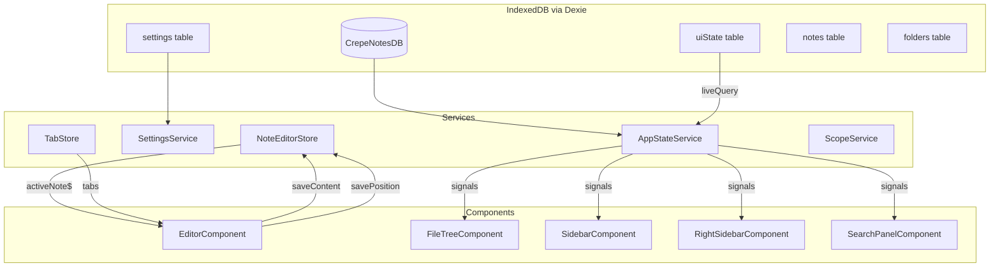

# Full State Management Architecture Plan

## ✅ IMPLEMENTATION COMPLETE

### What Was Done

1. **Bug Fix**: Removed duplicate note restoration from `AppComponent` that was using wrong key (`kittclouds-last-note-id` vs `kittclouds-active-note`)

2. **New Dexie Table**: Added `UIState` table (version 16) with comprehensive UI state schema

3. **AppStateService**: Created centralized state management service with `liveQuery()` integration

4. **Migrated Services**:
   - `SidebarService` → uses `AppStateService.leftSidebarMode`
   - `RightSidebarService` → uses `AppStateService.rightSidebarMode`
   - `FileTreeComponent` → uses `AppStateService.expandedFolderIds`

### Files Modified

| File | Change |
|------|--------|
| [`src/app/lib/dexie/db.ts`](../src/app/lib/dexie/db.ts) | Added `UIState` interface, `getDefaultUIState()`, and v16 schema |
| [`src/app/lib/services/app-state.service.ts`](../src/app/lib/services/app-state.service.ts) | **NEW** - Centralized state with liveQuery |
| [`src/app/lib/services/sidebar.service.ts`](../src/app/lib/services/sidebar.service.ts) | Migrated to use AppStateService |
| [`src/app/lib/services/right-sidebar.service.ts`](../src/app/lib/services/right-sidebar.service.ts) | Migrated to use AppStateService |
| [`src/app/components/sidebar/file-tree/file-tree.component.ts`](../src/app/components/sidebar/file-tree/file-tree.component.ts) | Uses AppStateService for expansion |
| [`src/app/app.component.ts`](../src/app/app.component.ts) | Removed duplicate restoration logic |

---

## Overview

This plan establishes comprehensive state persistence using Dexie.js (IndexedDB) with Angular Signals and `liveQuery()`. The goal is to ensure that **all UI state survives page refresh**, including:

- Last open note and cursor position
- Open tabs
- Sidebar states (left and right)
- Active panels and tabs
- Folder expansion state
- Search state
- Theme preferences
- Panel dimensions

## Current State Analysis

### Already Persisted ✅

| State | Storage Key | Location |
|-------|-------------|----------|
| Active Note ID | `kittclouds-active-note` | [`NoteEditorStore`](../src/app/lib/store/note-editor.store.ts:15) |
| Editor Position | `kittclouds-editor-position` | [`NoteEditorStore`](../src/app/lib/store/note-editor.store.ts:16) |
| Open Tabs | `kittclouds-open-tabs` | [`TabStore`](../src/app/lib/store/tab.store.ts:17) |
| Active Scope | `kittclouds-active-scope` | [`ScopeService`](../src/app/lib/services/scope.service.ts) |
| Blueprint Hub Tab | `kittclouds-blueprint-hub-active-tab` | [`BlueprintHubComponent`](../src/app/components/blueprint-hub/blueprint-hub.component.ts:32) |
| Worldbuilding Tab | `kittclouds-worldbuilding-active-tab` | [`WorldbuildingTabComponent`](../src/app/components/blueprint-hub/tabs/worldbuilding-tab/worldbuilding-tab.component.ts:60) |
| **Left Sidebar Mode** | `UIState.leftSidebarMode` | [`AppStateService`](../src/app/lib/services/app-state.service.ts) |
| **Right Sidebar Mode** | `UIState.rightSidebarMode` | [`AppStateService`](../src/app/lib/services/app-state.service.ts) |
| **Folder Expansion** | `UIState.expandedFolderIds` | [`AppStateService`](../src/app/lib/services/app-state.service.ts) |

### Infrastructure Ready (Optional Implementation)

| State | Field in UIState | How to Use |
|-------|------------------|------------|
| Search Query | `searchQuery` | `appState.setSearchQuery(query)` |
| Search Mode | `searchMode` | `appState.setSearchMode(mode)` |
| Calendar View | `calendarView` | `appState.setCalendarView(view)` |
| Theme | `theme` | `appState.setTheme(theme)` |
| Panel Dimensions | `leftSidebarWidth`, etc. | `appState.setLeftSidebarWidth(px)` |

## Architecture Design

### 1. Unified AppState Schema

Add a new Dexie table for structured UI state:

```typescript
// src/app/lib/dexie/db.ts

export interface UIState {
    id: string;                    // Single row: 'app-state'
    
    // Sidebar states
    leftSidebarMode: 'open' | 'collapsed' | 'closed';
    rightSidebarMode: 'open' | 'closed';
    rightSidebarActivePanel: 'entities' | 'timeline' | 'chat';
    
    // Panel dimensions
    leftSidebarWidth: number;
    rightSidebarWidth: number;
    hubHeight: number;
    
    // Folder expansion
    expandedFolderIds: string[];
    
    // Search state
    searchQuery: string;
    searchMode: 'vector' | 'keyword' | 'raptor';
    searchScope: 'all' | 'narrative';
    
    // Calendar state
    calendarView: 'month' | 'week' | 'timeline';
    calendarSelectedDate: string;    // ISO date string
    
    // Theme
    theme: 'light' | 'dark' | 'system';
    highlightMode: 'all' | 'focused' | 'none';
    focusedEntityKinds: string[];
    
    // Timestamps
    updatedAt: number;
}
```

### 2. AppStateService with liveQuery

```typescript
// src/app/lib/services/app-state.service.ts

@Injectable({ providedIn: 'root' })
export class AppStateService {
    private readonly STATE_ID = 'app-state';
    
    // Reactive state via liveQuery
    readonly state$ = from(
        liveQuery(() => db.uiState.get(this.STATE_ID))
    ).pipe(
        map(state => state ?? this.getDefaultState())
    );
    
    // Signal for template use
    readonly state = toSignal(this.state$, { 
        initialValue: this.getDefaultState() 
    });
    
    // Computed slices
    readonly leftSidebarMode = computed(() => this.state()?.leftSidebarMode ?? 'open');
    readonly rightSidebarMode = computed(() => this.state()?.rightSidebarMode ?? 'open');
    readonly expandedFolders = computed(() => new Set(this.state()?.expandedFolderIds ?? []));
    
    // Update methods (write to Dexie)
    async updateState(partial: Partial<UIState>): Promise<void> {
        const current = await db.uiState.get(this.STATE_ID);
        const updated = { 
            ...this.getDefaultState(), 
            ...current, 
            ...partial,
            updatedAt: Date.now() 
        };
        await db.uiState.put(updated);
    }
    
    // Convenience methods
    setLeftSidebarMode(mode: 'open' | 'collapsed' | 'closed'): void {
        this.updateState({ leftSidebarMode: mode });
    }
    
    toggleFolderExpansion(folderId: string): void {
        const current = this.expandedFolders();
        const next = new Set(current);
        if (next.has(folderId)) {
            next.delete(folderId);
        } else {
            next.add(folderId);
        }
        this.updateState({ expandedFolderIds: [...next] });
    }
}
```

### 3. Angular liveQuery Integration Pattern

Following the [Dexie liveQuery docs for Angular](https://dexie.org/docs/liveQuery()#svelte-and-angular):

```typescript
// Pattern 1: Observable from liveQuery
const notes$ = from(liveQuery(() => db.notes.toArray()));

// Pattern 2: Signal from Observable
const notes = toSignal(notes$, { initialValue: [] });

// Pattern 3: Effect for side effects
effect(() => {
    const currentNote = this.noteEditorStore.currentNote();
    if (currentNote) {
        this.analyticsService.trackView(currentNote.id);
    }
});
```

### 4. Migration Strategy

#### Phase 1: Create Infrastructure
1. Add `UIState` interface to [`db.ts`](../src/app/lib/dexie/db.ts)
2. Add `uiState` table to Dexie schema (version 16)
3. Create [`AppStateService`](../src/app/lib/services/app-state.service.ts)

#### Phase 2: Migrate Services
1. **SidebarService** - Inject AppStateService, persist mode changes
2. **RightSidebarService** - Same pattern
3. **FileTreeComponent** - Use AppStateService for expansion state
4. **SearchPanelComponent** - Persist search state

#### Phase 3: Component Updates
1. Update components to use AppStateService signals
2. Remove local state initialization from constructors
3. Add restoration logic in ngOnInit

### 5. Data Flow Diagram



### 6. State Restoration Sequence

```mermaid
sequenceDiagram
    participant App as AppComponent
    participant DB as Dexie
    participant AppState as AppStateService
    participant NoteEditor as NoteEditorStore
    participant Editor as EditorComponent
    
    App->>DB: Initialize Dexie
    DB->>AppState: liveQuery emits cached state
    AppState->>AppState: Hydrate signals
    
    App->>NoteEditor: restoreActiveNote
    NoteEditor->>DB: Get last note ID from settings
    DB-->>NoteEditor: noteId
    NoteEditor->>DB: Verify note exists
    DB-->>NoteEditor: Note data
    NoteEditor->>Editor: Load note content
    
    Editor->>NoteEditor: getPendingPosition
    NoteEditor-->>Editor: scroll + cursor position
    Editor->>Editor: Restore scroll and cursor
    
    Note->>AppState: State fully restored
```

## Implementation Checklist

### Phase 1: Infrastructure
- [ ] Add `UIState` interface to `db.ts`
- [ ] Add `uiState` table to Dexie schema (version 16)
- [ ] Create `AppStateService` with liveQuery integration
- [ ] Add default state factory

### Phase 2: Service Migration
- [ ] Migrate `SidebarService` to use `AppStateService`
- [ ] Migrate `RightSidebarService` to use `AppStateService`
- [ ] Add active panel tracking to `RightSidebarComponent`
- [ ] Migrate folder expansion to `AppStateService`

### Phase 3: Component Updates
- [ ] Update `FileTreeComponent` for expansion persistence
- [ ] Update `SearchPanelComponent` for search state persistence
- [ ] Update calendar components for view state persistence
- [ ] Add theme preference persistence

### Phase 4: Panel Dimensions
- [ ] Add resize event handlers to panel components
- [ ] Persist dimensions to `AppStateService`
- [ ] Restore dimensions on app load

### Phase 5: Testing
- [ ] Unit tests for `AppStateService`
- [ ] Integration tests for state restoration
- [ ] E2E test: refresh preserves all state

## Key Benefits

1. **Single Source of Truth**: All UI state in Dexie, not scattered in services
2. **Reactive Updates**: `liveQuery` automatically propagates DB changes to UI
3. **Offline-First**: State survives refresh, offline use, and browser restart
4. **Debuggable**: Can inspect state in DevTools Application tab
5. **Consistent Pattern**: Same pattern for all state, easy to extend

## Notes

- The existing `settings` table (key-value) is kept for simple settings
- `UIState` table is for structured, typed UI state
- Both patterns coexist: settings for simple values, UIState for complex state
- `liveQuery` handles the reactivity bridge between Dexie and Angular
