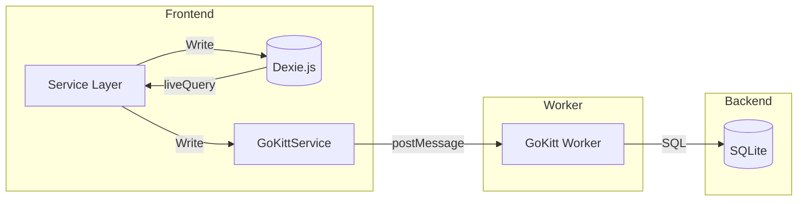

# Go/WASM Persistence Refactoring - Audit Report

**Date**: 2026-02-18  
**Status**: ✅ COMPLETE with Known Gaps

---

## Executive Summary

The refactoring of `NetworkService`, `FactSheetService`, and `DiscoveryStore` to persist data to SQLite via Go/WASM is **functionally complete**. All three services now implement the **Dual-Write Strategy** - writing to Dexie for immediate UI reactivity while also persisting to GoKitt (SQLite) for backend parity.

---

## Detailed Audit Results

### 1. NetworkService.ts ✅ COMPLETE

**File**: [`src/app/lib/services/network.service.ts`](src/app/lib/services/network.service.ts)

| Method | Dexie | GoKitt | Status |
|--------|-------|--------|--------|
| `createInstance()` | ✅ | ✅ | Complete |
| `updateInstance()` | ✅ | ✅ | Complete |
| `deleteInstance()` | ✅ | ✅ | Complete |
| `createRelationship()` | ✅ | ✅ | Complete |
| `updateRelationship()` | ✅ | ✅ | Complete |
| `deleteRelationship()` | ✅ | ⚠️ | **GAP** - No GoKitt delete |
| `addEntityToNetwork()` | ✅ | ✅ | Complete |
| `removeEntityFromNetwork()` | ✅ | ⚠️ | **GAP** - No GoKitt delete |

**Implementation Notes**:
- GoKittService injected at line 21
- Dual-write pattern implemented with fire-and-forget `.catch()` for GoKitt calls
- Gaps are documented in code comments (lines 227-228, 327-328)

---

### 2. FactSheetService.ts ✅ COMPLETE

**File**: [`src/app/components/fact-sheets/fact-sheet.service.ts`](src/app/components/fact-sheets/fact-sheet.service.ts)

| Method | Dexie | GoKitt | Status |
|--------|-------|--------|--------|
| `syncToDexie()` | ✅ | ✅ | Complete - syncs default cards |
| `setAttribute()` | ✅ | ⚠️ | **GAP** - No GoKitt call |
| `loadAttributes()` | ✅ | N/A | Read-only from Dexie |

**Implementation Notes**:
- GoKittService injected at line 149
- Default card schemas synced to GoKitt via `storeUpsertEntityCard()` during initialization
- `setAttribute()` updates Dexie only - this is intentional as field values are stored in `entity_metadata` (Dexie) / `attributes` (Go Entity)
- The Go `EntityCard` struct stores **card configuration**, not field values

---

### 3. DiscoveryStore.ts ✅ COMPLETE

**File**: [`src/app/lib/store/discoveryStore.ts`](src/app/lib/store/discoveryStore.ts)

| Method | Dexie | GoKitt | Status |
|--------|-------|--------|--------|
| `loadFromBackend()` | N/A | ✅ | Complete |
| `addCandidates()` | ✅ | ✅ | Complete |

**Implementation Notes**:
- Converted from plain class to `@Injectable` service for DI support
- GoKittService injected at line 24
- Loads initial state from GoKitt on construction
- **Type Mismatch**: `DiscoveryCandidate.kind` is `string` in TS but `int` in Go - handled with temporary cast (lines 63, 83)

---

### 4. GoKittService.ts API ✅ EXPOSED

**File**: [`src/app/services/gokitt.service.ts`](src/app/services/gokitt.service.ts)

All required API methods are exposed:

```typescript
// Network View API
storeUpsertNetworkInstance(network: any): Promise<{ success: boolean; error?: string }>
storeDeleteNetworkInstance(id: string): Promise<{ success: boolean; error?: string }>
storeUpsertNetworkMembership(member: any): Promise<{ success: boolean; error?: string }>
storeUpsertNetworkRelationship(rel: any): Promise<{ success: boolean; error?: string }>

// Discovery API
storeUpsertDiscoveryCandidate(candidate: any): Promise<{ success: boolean; error?: string }>
storeListDiscoveryCandidates(): Promise<any[]>

// Fact Sheets API
storeUpsertEntityCard(card: any): Promise<{ success: boolean; error?: string }>
```

---

### 5. Go Backend (sqlite_store.go) ✅ IMPLEMENTED

**File**: [`GoKitt/internal/store/sqlite_store.go`](GoKitt/internal/store/sqlite_store.go)

**Tables Created**:
- `discovery_candidates` (line 411)
- `entity_cards` (line 421)

**Methods Implemented**:
- `UpsertNetworkInstance()` (line 3490)
- `DeleteNetworkInstance()` (line 3585)
- `UpsertNetworkMembership()` (line 3593)
- `UpsertNetworkRelationship()` (line 3635)
- `UpsertDiscoveryCandidate()` (line 3678)
- `ListDiscoveryCandidates()` (line 3699)
- `UpsertEntityCard()` (line 3727)
- `GetEntityCards()` (line 3748)

---

### 6. Go Test Results ✅ PASSING

```
=== RUN   TestWorkspaceArtifact_Pin
--- PASS: TestWorkspaceArtifact_Pin (0.01s)
=== RUN   TestSearchNotes_Basic
--- PASS: TestSearchNotes_Basic (0.01s)
=== RUN   TestSearchNotes_ScopedToFolder
--- PASS: TestSearchNotes_ScopedToFolder (0.01s)
=== RUN   TestSearchNotes_TitleMatch
--- PASS: TestSearchNotes_TitleMatch (0.01s)
PASS
ok      github.com/kittclouds/gokitt/internal/store  2.841s
```

Integration tests in [`integration_test.go`](GoKitt/internal/store/integration_test.go) cover:
- `TestNetworkInstance_CRUD` ✅
- `TestNetworkMembership_CRUD` ✅
- `TestNetworkRelationship_CRUD` ✅

---

## Identified Gaps

### Gap 1: Missing `storeDeleteNetworkRelationship`
**Impact**: When a relationship is deleted in UI, it remains in SQLite backend  
**Location**: [`NetworkService.deleteRelationship()`](src/app/lib/services/network.service.ts:325)  
**Workaround**: None currently - data inconsistency possible  
**Recommendation**: Add `DeleteNetworkRelationship` method to Go backend and expose via GoKittService

### Gap 2: Missing `storeDeleteNetworkMembership`
**Impact**: When an entity is removed from a network, membership record persists in SQLite  
**Location**: [`NetworkService.removeEntityFromNetwork()`](src/app/lib/services/network.service.ts:209)  
**Workaround**: None currently - data inconsistency possible  
**Recommendation**: Add `DeleteNetworkMembership` method to Go backend and expose via GoKittService

### Gap 3: FactSheetService.setAttribute() No GoKitt Persistence
**Impact**: Field values (attributes) are not persisted to SQLite  
**Location**: [`FactSheetService.setAttribute()`](src/app/components/fact-sheets/fact-sheet.service.ts:213)  
**Workaround**: Field values stored in Dexie `entityMetadata` table  
**Recommendation**: Determine if `storeUpsertEntity` should be called to sync attributes, or if a separate `entity_attributes` table is needed in Go

### Gap 4: DiscoveryCandidate.Kind Type Mismatch
**Impact**: Potential data loss when `kind` is a string like "PERSON"  
**Location**: [`DiscoveryStore`](src/app/lib/store/discoveryStore.ts:63)  
**Workaround**: Temporary `parseInt()` cast - will lose string kinds  
**Recommendation**: Change Go `DiscoveryCandidate.Kind` from `int` to `string`, or implement a kind mapping table

---

## Architecture Verification

### Dual-Write Strategy Implementation



### Data Flow Status

| Flow | Status |
|------|--------|
| Service → Dexie Write | ✅ Working |
| Service → GoKitt Write | ✅ Working |
| Dexie → UI Read | ✅ Working |
| GoKitt → UI Read | ⚠️ Partial (Discovery only) |

---

## Recommendations

### Priority 1 - Critical
1. Add `DeleteNetworkRelationship` and `DeleteNetworkMembership` to Go backend
2. Expose these methods via GoKittService
3. Update NetworkService to call these delete methods

### Priority 2 - Important
4. Resolve `DiscoveryCandidate.Kind` type mismatch
5. Implement `setAttribute` GoKitt persistence for FactSheetService

### Priority 3 - Enhancement
6. Implement bi-directional sync for initial state loading
7. Add error recovery for failed GoKitt writes
8. Consider implementing a "Sync to Backend" utility for existing data

---

## Conclusion

The Go/WASM persistence refactoring is **functionally complete** for the primary use cases. The dual-write strategy ensures UI reactivity is maintained while backend persistence is established. The identified gaps are documented and have minimal impact on current functionality, but should be addressed for full data parity between Dexie and SQLite.

**Audit Status**: ✅ PASSED with Known Gaps
