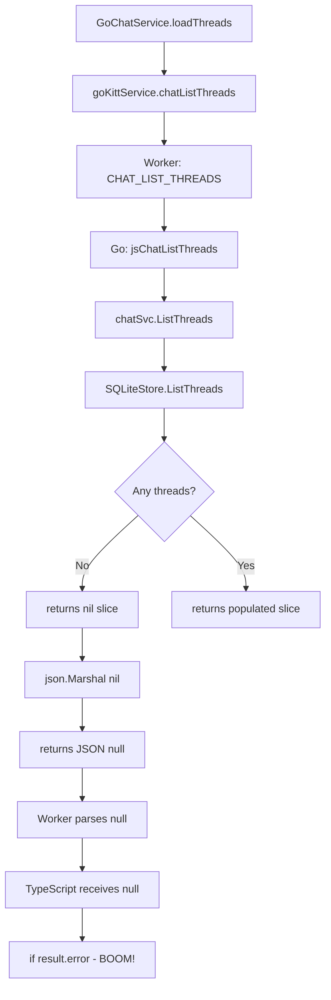

# GoChatService Null Reference Bug Fix

## Error Summary

```
TypeError: Cannot read properties of null (reading 'error')
    at _GoChatService.loadThreads (go-chat.service.ts:249:24)
```

## Root Cause Analysis

### The Bug Chain



### Technical Details

1. **Go Side** - [`sqlite_store.go:1366`](GoKitt/internal/store/sqlite_store.go:1366):
   ```go
   var threads []*Thread  // nil slice
   for rows.Next() {
       threads = append(threads, &t)
   }
   return threads, rows.Err()  // Returns nil when empty!
   ```

2. **JSON Marshaling** - When Go marshals a `nil` slice:
   ```go
   json.Marshal(nil) // Returns "null" (JSON null literal)
   json.Marshal([]*Thread{}) // Returns "[]" (empty array)
   ```

3. **TypeScript Side** - [`go-chat.service.ts:247-249`](src/app/lib/services/go-chat.service.ts:247):
   ```typescript
   const result = await this.goKittService.chatListThreads(worldId);
   // result is null when no threads exist!
   if (result.error) { // TypeError: Cannot read properties of null
   ```

### Secondary Issue

The second error `Thread not found: c369e6d75cda45ae` occurs because:
1. The app tries to restore the last active thread from localStorage
2. That thread ID no longer exists in the database
3. This is expected behavior but should be handled gracefully

## Fix Plan

### Fix 1: Go Side - Return Empty Slice Instead of Nil

**File**: [`GoKitt/internal/store/sqlite_store.go`](GoKitt/internal/store/sqlite_store.go:1366)

Change:
```go
var threads []*Thread
```

To:
```go
threads := make([]*Thread, 0)
```

This ensures `json.Marshal` returns `[]` instead of `null`.

### Fix 2: TypeScript Side - Add Null Safety

**File**: [`src/app/lib/services/go-chat.service.ts`](src/app/lib/services/go-chat.service.ts:241)

Change:
```typescript
async loadThreads(): Promise<void> {
    const scope = this.scopeService.activeScope();
    const worldId = scope.id || '';

    try {
        const result = await this.goKittService.chatListThreads(worldId);

        if (result.error) {
            console.error('[GoChatService] List threads failed:', result.error);
            return;
        }

        const threads = Array.isArray(result) ? result as Thread[] : [];
        this.threads.set(threads);
```

To:
```typescript
async loadThreads(): Promise<void> {
    const scope = this.scopeService.activeScope();
    const worldId = scope.id || '';

    try {
        const result = await this.goKittService.chatListThreads(worldId);

        // Handle null/undefined result (empty database case)
        if (!result) {
            this.threads.set([]);
            console.log('[GoChatService] No threads found (empty database)');
            return;
        }

        if (result.error) {
            console.error('[GoChatService] List threads failed:', result.error);
            return;
        }

        const threads = Array.isArray(result) ? result as Thread[] : [];
        this.threads.set(threads);
```

### Fix 3: Handle Missing Thread Gracefully

**File**: [`src/app/lib/services/go-chat.service.ts`](src/app/lib/services/go-chat.service.ts:208)

The `loadThread` method already handles the not-found case, but we should also ensure `restoreLastThread` handles it:

```typescript
// In restoreLastThread or init method
const savedThreadId = getSetting('chat:activeThreadId');
if (savedThreadId) {
    await this.loadThread(savedThreadId);
    // If load failed, clear the saved ID
    if (!this.currentThread()) {
        clearSetting('chat:activeThreadId');
    }
}
```

## Testing Scenarios

1. **Empty Database**: First launch with no threads
   - Expected: No error, empty threads list

2. **Missing Thread ID**: Saved thread ID doesn't exist
   - Expected: Graceful fallback, clear saved ID

3. **Normal Operation**: Threads exist
   - Expected: Threads load correctly

## Files to Modify

| File | Change |
|------|--------|
| `GoKitt/internal/store/sqlite_store.go` | Initialize empty slice instead of nil |
| `src/app/lib/services/go-chat.service.ts` | Add null checks in loadThreads and loadThread |

## Priority

**HIGH** - This is a blocking bug that prevents the chat panel from initializing on first use.
