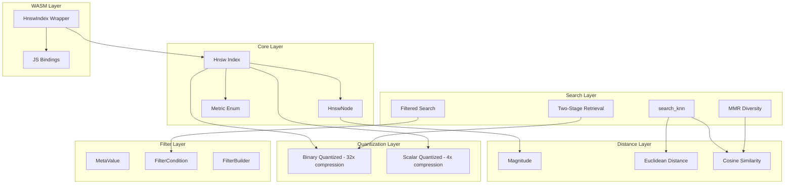

# HNSW Go Port Plan: 1:1 Rust Translation

## Overview

Port the Rust HNSW implementation to Go for WASM deployment. Dimensions supported: **64-1536**.

**Source:** [`GoKitt/docs/rusthnsw.md`](GoKitt/docs/rusthnsw.md) (3033 lines)

---

## Architecture Components



---

## Package Structure

```
GoKitt/pkg/hnsw/
├── distance/
│   ├── distance.go           # magnitude, euclidean, cosine
│   └── distance_test.go
├── node/
│   ├── node.go               # HnswNode struct
│   └── node_test.go
├── pqueue/
│   ├── pqueue.go             # ScoredItem priority queue
│   └── pqueue_test.go
├── quantization/
│   ├── binary.go             # BinaryQuantized - 32x compression
│   ├── binary_test.go
│   ├── scalar.go             # ScalarQuantized - 4x compression
│   └── scalar_test.go
├── filter/
│   ├── filter.go             # MetaValue, FilterCondition, FilterBuilder
│   └── filter_test.go
├── mmr/
│   ├── mmr.go                # Maximal Marginal Relevance
│   └── mmr_test.go
├── index.go                  # Hnsw main index
├── index_test.go
├── serialize.go              # Serialization/Deserialization
├── serialize_test.go
├── wasm.go                   # WASM bindings
└── wasm_test.go
```

---

## Phase 1: Distance Functions

### Files: `pkg/hnsw/distance/distance.go`

**Rust Source:** Lines 487-569

```go
// Package distance provides vector similarity functions with loop unrolling
package distance

// Magnitude computes L2 norm with 4x loop unrolling
func Magnitude(v []float32) float32

// EuclideanDistanceSquared computes L2^2 with 4x loop unrolling
func EuclideanDistanceSquared(a, b []float32) float32

// CosineSimilarity computes cosine with optional precomputed magnitudes
func CosineSimilarity(a, b []float32, magA, magB float32) float32
```

### Test Cases (TDD Red First)

```go
func TestMagnitude(t *testing.T) {
    // Basic
    assert.InDelta(t, 3.0, Magnitude([]float32{3.0, 0.0, 0.0}), 1e-6)
    assert.InDelta(t, 5.0, Magnitude([]float32{3.0, 4.0}), 1e-6)
    
    // Empty
    assert.Equal(t, 0.0, Magnitude([]float32{}))
    
    // Large vector 384D
    v := make([]float32, 384)
    for i := range v { v[i] = 1.0 }
    assert.InDelta(t, 19.5959, Magnitude(v), 0.01)
}

func TestEuclideanDistanceSquared(t *testing.T) {
    // Identical
    assert.Equal(t, 0.0, EuclideanDistanceSquared([]float32{1,2,3}, []float32{1,2,3}))
    
    // Unit distance
    assert.InDelta(t, 1.0, EuclideanDistanceSquared([]float32{0}, []float32{1}), 1e-6)
    
    // 3D
    assert.InDelta(t, 14.0, EuclideanDistanceSquared([]float32{1,2,3}, []float32{2,3,5}), 1e-6)
}

func TestCosineSimilarity(t *testing.T) {
    // Identical direction
    sim := CosineSimilarity([]float32{1,0,0}, []float32{2,0,0}, 0, 0)
    assert.InDelta(t, 1.0, sim, 1e-6)
    
    // Orthogonal
    sim = CosineSimilarity([]float32{1,0}, []float32{0,1}, 0, 0)
    assert.InDelta(t, 0.0, sim, 1e-6)
    
    // Opposite
    sim = CosineSimilarity([]float32{1,0}, []float32{-1,0}, 0, 0)
    assert.InDelta(t, -1.0, sim, 1e-6)
    
    // With precomputed magnitudes
    sim = CosineSimilarity([]float32{3,4}, []float32{6,8}, 5.0, 10.0)
    assert.InDelta(t, 1.0, sim, 1e-6)
}
```

---

## Phase 2: Priority Queue

### Files: `pkg/hnsw/pqueue/pqueue.go`

**Rust Source:** Lines 2402-2433

```go
// Package pqueue provides a priority queue for HNSW search
package pqueue

// ScoredItem is an item with a score for priority queue ordering
type ScoredItem struct {
    Score float32
    ID    uint32
}

// MaxHeap implements a max-heap by score
type MaxHeap []ScoredItem

// MinHeap implements a min-heap by score (for keeping top-k)
type MinHeap []ScoredItem
```

### Test Cases

```go
func TestMaxHeap(t *testing.T) {
    h := &MaxHeap{}
    heap.Push(h, ScoredItem{Score: 0.5, ID: 1})
    heap.Push(h, ScoredItem{Score: 0.9, ID: 2})
    heap.Push(h, ScoredItem{Score: 0.3, ID: 3})
    
    // Pop returns highest score first
    top := heap.Pop(h).(ScoredItem)
    assert.Equal(t, uint32(2), top.ID)
    assert.InDelta(t, 0.9, top.Score, 1e-6)
}

func TestMinHeap(t *testing.T) {
    h := &MinHeap{}
    heap.Push(h, ScoredItem{Score: 0.5, ID: 1})
    heap.Push(h, ScoredItem{Score: 0.9, ID: 2})
    
    // Pop returns lowest score first
    top := heap.Pop(h).(ScoredItem)
    assert.Equal(t, uint32(1), top.ID)
}
```

---

## Phase 3: HnswNode

### Files: `pkg/hnsw/node/node.go`

**Rust Source:** Lines 2329-2399

```go
// Package node provides the HNSW node structure
package node

// HnswNode represents a single node in the HNSW graph
type HnswNode struct {
    ID        uint32
    Level     uint8
    Vector    []float32
    Neighbors [][]int32  // Neighbors per level (signed for sentinel values)
    Deleted   bool
    
    // Cached values
    magnitude  float32
    magCached  bool
    normalized []float32
}
```

### Test Cases

```go
func TestNewNode(t *testing.T) {
    n := NewNode(42, 3, []float32{1, 2, 3}, 4)
    assert.Equal(t, uint32(42), n.ID)
    assert.Equal(t, uint8(3), n.Level)
    assert.Equal(t, 4, len(n.Neighbors))  // Pre-allocated layers
    assert.False(t, n.Deleted)
}

func TestGetMagnitude(t *testing.T) {
    n := NewNode(1, 0, []float32{3, 4}, 1)
    
    // First call computes
    mag := n.GetMagnitude()
    assert.InDelta(t, 5.0, mag, 1e-6)
    
    // Second call uses cache
    mag2 := n.GetMagnitude()
    assert.Equal(t, mag, mag2)
}

func TestGetNormalized(t *testing.T) {
    n := NewNode(1, 0, []float32{3, 4}, 1)
    norm := n.GetNormalized()
    
    assert.InDelta(t, 0.6, norm[0], 1e-6)
    assert.InDelta(t, 0.8, norm[1], 1e-6)
}

func TestAddNeighbor(t *testing.T) {
    n := NewNode(1, 2, []float32{1}, 3)
    n.AddNeighbor(0, 42)
    n.AddNeighbor(1, 100)
    
    assert.Equal(t, []int32{42}, n.Neighbors[0])
    assert.Equal(t, []int32{100}, n.Neighbors[1])
}
```

---

## Phase 4: Binary Quantization

### Files: `pkg/hnsw/quantization/binary.go`

**Rust Source:** Lines 1-485

```go
// Package quantization provides vector compression for HNSW
package quantization

// BinaryQuantized represents a vector compressed to binary sign bits
// 32x compression: 768D f32 (3072 bytes) -> 96 bytes
type BinaryQuantized struct {
    Data       []uint64  // Packed sign bits
    Dimensions int
}

// Quantize converts f32 vector to binary sign bits
func (bq *BinaryQuantized) Quantize(vector []float32)

// HammingDistance computes bit difference count
func (bq *BinaryQuantized) HammingDistance(other *BinaryQuantized) uint32

// Similarity returns normalized similarity [0,1]
func (bq *BinaryQuantized) Similarity(other *BinaryQuantized) float32
```

### Test Cases

```go
func TestQuantizeBasic(t *testing.T) {
    v := []float32{1.0, -1.0, 0.5, -0.5, 0.0}
    bq := Quantize(v)
    
    assert.Equal(t, 5, bq.Dimensions)
    // Bits: 1, 0, 1, 0, 1 -> 0b10101 = 21
    assert.Equal(t, uint64(0b10101), bq.Data[0] & 0b11111)
}

func TestQuantizeDimensions(t *testing.T) {
    // 64D - fits in 1 uint64
    v64 := make([]float32, 64)
    bq64 := Quantize(v64)
    assert.Equal(t, 1, len(bq64.Data))
    
    // 384D - needs 6 uint64s
    v384 := make([]float32, 384)
    bq384 := Quantize(v384)
    assert.Equal(t, 6, len(bq384.Data))
    
    // 1536D - needs 24 uint64s
    v1536 := make([]float32, 1536)
    bq1536 := Quantize(v1536)
    assert.Equal(t, 24, len(bq1536.Data))
}

func TestHammingDistance(t *testing.T) {
    v1 := []float32{1, 1, 1, 1}
    v2 := []float32{-1, -1, -1, -1}
    
    bq1 := Quantize(v1)
    bq2 := Quantize(v2)
    
    assert.Equal(t, uint32(4), bq1.HammingDistance(bq2))
}

func TestSimilarity(t *testing.T) {
    v := []float32{1, -1, 1, -1}
    bq1 := Quantize(v)
    bq2 := Quantize(v)
    
    assert.InDelta(t, 1.0, bq1.Similarity(bq2), 1e-6)
}

func TestCompressionRatio(t *testing.T) {
    v := make([]float32, 768)
    bq := Quantize(v)
    
    // 768 * 4 = 3072 bytes -> 96 bytes (12 uint64s)
    assert.Equal(t, 12, len(bq.Data))
    ratio := float32(768*4) / float32(len(bq.Data)*8+8)
    assert.True(t, ratio > 30.0)  // ~32x compression
}
```

---

## Phase 5: Scalar Quantization

### Files: `pkg/hnsw/quantization/scalar.go`

**Rust Source:** Lines 2435-2797

```go
// ScalarQuantized represents f32 -> u8 compression
// 4x compression with ~1% recall loss
type ScalarQuantized struct {
    Data  []uint8
    Min   float32
    Scale float32
}

// Quantize converts f32 to u8 using min-max normalization
func (sq *ScalarQuantized) Quantize(vector []float32)

// Reconstruct approximates original f32 vector
func (sq *ScalarQuantized) Reconstruct() []float32

// DistanceL2Squared computes approximate L2^2 distance
func (sq *ScalarQuantized) DistanceL2Squared(other *ScalarQuantized) float32

// CosineToQuery computes cosine similarity to full-precision query
func (sq *ScalarQuantized) CosineToQuery(query []float32, queryMag float32) float32
```

### Test Cases

```go
func TestScalarQuantizeBasic(t *testing.T) {
    v := []float32{1.0, 2.0, 3.0, 4.0, 5.0}
    sq := ScalarQuantize(v)
    
    assert.Equal(t, 5, len(sq.Data))
    assert.InDelta(t, 1.0, sq.Min, 1e-6)
    assert.True(t, sq.Scale > 0)
}

func TestScalarReconstructRoundtrip(t *testing.T) {
    v := []float32{1.0, 2.0, 3.0, 4.0, 5.0}
    sq := ScalarQuantize(v)
    recon := sq.Reconstruct()
    
    maxError := (5.0 - 1.0) / 255.0 * 2.0
    for i := range v {
        assert.InDelta(t, v[i], recon[i], maxError)
    }
}

func TestScalarCompressionRatio(t *testing.T) {
    v := make([]float32, 768)
    sq := ScalarQuantize(v)
    
    // 768 * 4 = 3072 bytes -> 776 bytes (768 + 8 overhead)
    ratio := float32(768*4) / float32(len(sq.Data)+8)
    assert.True(t, ratio > 3.5 && ratio < 4.5)
}
```

---

## Phase 6: Metadata Filtering

### Files: `pkg/hnsw/filter/filter.go`

**Rust Source:** Lines 572-978

```go
// Package filter provides metadata filtering for HNSW search
package filter

// MetaValue represents a metadata value
type MetaValue interface {
    AsString() (string, bool)
    AsFloat() (float64, bool)
    AsBool() (bool, bool)
    Contains(value string) bool
}

// MetaString, MetaNumber, MetaBool, MetaArray implementations...

// FilterCondition represents a filter predicate
type FilterCondition interface {
    Matches(meta map[string]MetaValue) bool
}

// Eq, Neq, In, Range, Contains, And, Or implementations...

// FilterBuilder provides fluent filter construction
type FilterBuilder struct {
    conditions []FilterCondition
}
```

### Test Cases

```go
func TestEqString(t *testing.T) {
    meta := map[string]MetaValue{
        "type": MetaString("meeting"),
    }
    
    filter := Eq{Field: "type", Value: MetaString("meeting")}
    assert.True(t, filter.Matches(meta))
    
    filter2 := Eq{Field: "type", Value: MetaString("note")}
    assert.False(t, filter2.Matches(meta))
}

func TestRange(t *testing.T) {
    meta := map[string]MetaValue{
        "year": MetaNumber(2024.0),
    }
    
    filter := Range{Field: "year", Min: ptr(2020.0), Max: ptr(2025.0)}
    assert.True(t, filter.Matches(meta))
}

func TestAnd(t *testing.T) {
    meta := map[string]MetaValue{
        "type": MetaString("meeting"),
        "year": MetaNumber(2024.0),
    }
    
    filter := And{Conditions: []FilterCondition{
        Eq{Field: "type", Value: MetaString("meeting")},
        Range{Field: "year", Min: ptr(2020.0), Max: nil},
    }}
    assert.True(t, filter.Matches(meta))
}

func TestFilterBuilder(t *testing.T) {
    filter := NewFilterBuilder().
        Eq("type", MetaString("meeting")).
        Range("priority", ptr(1.0), ptr(10.0)).
        Build()
    
    assert.NotNil(t, filter)
}
```

---

## Phase 7: MMR Diversity

### Files: `pkg/hnsw/mmr/mmr.go`

**Rust Source:** Lines 1917-2312

```go
// Package mmr provides Maximal Marginal Relevance for diverse search
package mmr

// MmrConfig configures diversity vs relevance balance
type MmrConfig struct {
    Lambda         float32  // 0.0 = pure diversity, 1.0 = pure relevance
    FetchMultiplier float32  // How many extra candidates to fetch
}

// MmrCandidate is a search result with vector for MMR computation
type MmrCandidate struct {
    ID     uint32
    Score  float32
    Vector []float32
}

// Rerank applies MMR to balance relevance and diversity
func Rerank(query []float32, candidates []MmrCandidate, k int, lambda float32) []uint32
```

### Test Cases

```go
func TestMmrReturnsK(t *testing.T) {
    query := []float32{1, 0, 0}
    candidates := []MmrCandidate{
        {ID: 1, Score: 0.9, Vector: []float32{0.9, 0.1, 0}},
        {ID: 2, Score: 0.8, Vector: []float32{0.8, 0.2, 0}},
        {ID: 3, Score: 0.7, Vector: []float32{0.7, 0.3, 0}},
    }
    
    results := Rerank(query, candidates, 2, 0.5)
    assert.Equal(t, 2, len(results))
}

func TestMmrPromotesDiversity(t *testing.T) {
    query := []float32{1, 0, 0}
    candidates := []MmrCandidate{
        {ID: 1, Score: 0.95, Vector: []float32{0.99, 0.01, 0}},  // Very similar to query
        {ID: 2, Score: 0.94, Vector: []float32{0.98, 0.02, 0}},  // Almost identical to #1
        {ID: 3, Score: 0.7, Vector: []float32{0, 0, 1}},         // Orthogonal/different
    }
    
    results := Rerank(query, candidates, 2, 0.5)
    
    // First should be most relevant
    assert.Equal(t, uint32(1), results[0])
    // Second should be diverse (#3), not near-duplicate (#2)
    assert.Equal(t, uint32(3), results[1])
}

func TestMmrPureRelevance(t *testing.T) {
    // Lambda = 1.0 should preserve original order
    query := []float32{1, 0}
    candidates := []MmrCandidate{
        {ID: 1, Score: 0.9, Vector: []float32{0.9, 0.1}},
        {ID: 2, Score: 0.85, Vector: []float32{0.88, 0.12}},
    }
    
    results := Rerank(query, candidates, 2, 1.0)
    assert.Equal(t, uint32(1), results[0])
    assert.Equal(t, uint32(2), results[1])
}
```

---

## Phase 8: HNSW Index Core

### Files: `pkg/hnsw/index.go`

**Rust Source:** Lines 980-1914

```go
// Package hnsw provides Hierarchical Navigable Small World graph
package hnsw

// Metric defines distance metric
type Metric int

const (
    Cosine Metric = iota
    Euclidean
)

// HnswError defines index errors
type HnswError int

const (
    ErrDuplicateID HnswError = iota
    ErrDimensionMismatch
    ErrEmptyVector
    ErrSerialization
)

// Hnsw is the main HNSW index
type Hnsw struct {
    // Configuration
    M              int     // Max neighbors per level
    MMax0          int     // Max neighbors at level 0 (usually 2*M)
    EfConstruction int     // Search beam width during construction
    LevelMult      float32 // Level generation multiplier (1/ln(M))
    Metric         Metric
    
    // State
    Nodes         map[uint32]*HnswNode
    EntryPointID  *uint32
    LevelMax      uint8
    Dimension     *int
    
    // Quantized storage
    Quantized       map[uint32]*ScalarQuantized
    BinaryQuantized map[uint32]*BinaryQuantized
    
    // RNG state
    rngState uint64
}

// Core methods
func New(m, efConstruction int, metric Metric) *Hnsw
func (h *Hnsw) AddPoint(id uint32, vector []float32) error
func (h *Hnsw) SearchKNN(query []float32, k int) []Result
func (h *Hnsw) SearchKNNFiltered(query []float32, k int, filter func(uint32) bool) []Result
func (h *Hnsw) DeletePoint(id uint32)

// Hybrid methods
func (h *Hnsw) AddPointQuantized(id uint32, vector []float32) error
func (h *Hnsw) AddPointBinary(id uint32, vector []float32) error
func (h *Hnsw) SearchHybrid(query []float32, k int) []Result
func (h *Hnsw) SearchTwoStage(query []float32, k int, rerankMultiplier float32) []Result
func (h *Hnsw) SearchWithDiversity(query []float32, k int, lambda float32) []Result
```

### Test Cases

```go
func TestNewHnsw(t *testing.T) {
    h := New(16, 200, Cosine)
    assert.Equal(t, 16, h.M)
    assert.Equal(t, 32, h.MMax0)
    assert.Equal(t, 200, h.EfConstruction)
    assert.NotNil(t, h.Nodes)
}

func TestAddPointFirst(t *testing.T) {
    h := New(16, 200, Cosine)
    err := h.AddPoint(1, []float32{1, 2, 3})
    
    assert.NoError(t, err)
    assert.Equal(t, 1, h.Len())
    assert.Equal(t, uint32(1), *h.EntryPointID)
}

func TestAddPointDuplicate(t *testing.T) {
    h := New(16, 200, Cosine)
    h.AddPoint(1, []float32{1, 2, 3})
    err := h.AddPoint(1, []float32{4, 5, 6})
    
    assert.Error(t, err)
    assert.Equal(t, ErrDuplicateID, err)
}

func TestAddPointDimensionMismatch(t *testing.T) {
    h := New(16, 200, Cosine)
    h.AddPoint(1, []float32{1, 2, 3})
    err := h.AddPoint(2, []float32{1, 2, 3, 4})
    
    assert.Error(t, err)
    assert.Equal(t, ErrDimensionMismatch, err)
}

func TestSearchKNNEmpty(t *testing.T) {
    h := New(16, 200, Cosine)
    results := h.SearchKNN([]float32{1, 2, 3}, 5)
    assert.Empty(t, results)
}

func TestSearchKNNBasic(t *testing.T) {
    h := New(16, 200, Cosine)
    
    // Add points on a line
    for i := 0; i < 100; i++ {
        v := make([]float32, 64)
        v[0] = float32(i)
        h.AddPoint(uint32(i), v)
    }
    
    query := make([]float32, 64)
    query[0] = 50.0
    
    results := h.SearchKNN(query, 5)
    assert.Equal(t, 5, len(results))
    
    // First result should be ID 50
    assert.Equal(t, uint32(50), results[0].ID)
}

func TestSearchKNNFiltered(t *testing.T) {
    h := New(16, 200, Cosine)
    
    for i := 0; i < 100; i++ {
        v := make([]float32, 64)
        v[0] = float32(i)
        h.AddPoint(uint32(i), v)
    }
    
    query := make([]float32, 64)
    query[0] = 50.0
    
    // Only allow even IDs
    filter := func(id uint32) bool { return id%2 == 0 }
    results := h.SearchKNNFiltered(query, 5, filter)
    
    for _, r := range results {
        assert.True(t, r.ID%2 == 0)
    }
}

func TestDeletePoint(t *testing.T) {
    h := New(16, 200, Cosine)
    h.AddPoint(1, []float32{1, 0, 0})
    h.AddPoint(2, []float32{0.9, 0.1, 0})
    
    h.DeletePoint(1)
    
    results := h.SearchKNN([]float32{1, 0, 0}, 5)
    assert.NotContains(t, results, Result{ID: 1})
}

func TestLevelDistribution(t *testing.T) {
    h := New(16, 200, Cosine)
    levels := [17]int{}
    
    for i := 0; i < 10000; i++ {
        level := h.selectLevel()
        levels[level]++
    }
    
    // Most should be level 0
    assert.True(t, levels[0] > 5000)
    // Higher levels should be less frequent
    assert.True(t, levels[0] > levels[1])
}
```

---

## Phase 9: Serialization

### Files: `pkg/hnsw/serialize.go`

**Rust Source:** Lines 1486-1642

```go
// Binary format:
// Header (18 bytes):
//   Magic: 0x48534E57 "HNSW" (4 bytes)
//   Dimension: u16 (2 bytes)
//   M: u16 (2 bytes)
//   NodeCount: u32 (4 bytes)
//   LevelMax: u16 (2 bytes)
//   EntryPointID: u32 (4 bytes, u32::MAX if None)
//
// Per Node:
//   ID: u32
//   LevelCount: u8
//   Vector: [f32; dimension]
//   Deleted: u8
//   Neighbors: for each level
//     Count: u16
//     IDs: [u32; count]

func (h *Hnsw) Serialize() []byte
func Deserialize(data []byte) (*Hnsw, error)
```

### Test Cases

```go
func TestSerializeEmpty(t *testing.T) {
    h := New(16, 200, Cosine)
    data := h.Serialize()
    
    h2, err := Deserialize(data)
    assert.NoError(t, err)
    assert.Equal(t, 0, h2.Len())
}

func TestSerializeRoundtrip(t *testing.T) {
    h := New(16, 200, Cosine)
    
    for i := 0; i < 100; i++ {
        v := make([]float32, 64)
        for j := range v {
            v[j] = float32(i + j)
        }
        h.AddPoint(uint32(i), v)
    }
    
    data := h.Serialize()
    h2, err := Deserialize(data)
    
    assert.NoError(t, err)
    assert.Equal(t, h.Len(), h2.Len())
    assert.Equal(t, *h.EntryPointID, *h2.EntryPointID)
    
    // Search should work on deserialized index
    query := make([]float32, 64)
    results := h2.SearchKNN(query, 5)
    assert.Equal(t, 5, len(results))
}

func TestSerializeMagic(t *testing.T) {
    h := New(16, 200, Cosine)
    data := h.Serialize()
    
    magic := binary.LittleEndian.Uint32(data[0:4])
    assert.Equal(t, uint32(0x48534E57), magic)
}
```

---

## Phase 10: WASM Bindings

### Files: `pkg/hnsw/wasm.go`

**Rust Source:** Lines 2799-3033

```go
// +build js,wasm

package hnsw

import "syscall/js"

// HnswIndex is the WASM-exposed wrapper
type HnswIndex struct {
    inner *Hnsw
}

// Constructor: new HnswIndex(m, efConstruction, metricIdx)
func NewHnswIndex(this js.Value, args []js.Value) interface{}

// addPoint(id, vector: Float32Array)
func (h *HnswIndex) AddPoint(this js.Value, args []js.Value) interface{}

// search(query: Float32Array, k: number): Uint32Array
func (h *HnswIndex) Search(this js.Value, args []js.Value) interface{}

// searchWithScores(query, k): [id, score][]
func (h *HnswIndex) SearchWithScores(this js.Value, args []js.Value) interface{}

// searchFiltered(query, k, allowedIds): Uint32Array
func (h *HnswIndex) SearchFiltered(this js.Value, args []js.Value) interface{}

// searchWithDiversity(query, k, lambda): Uint32Array
func (h *HnswIndex) SearchWithDiversity(this js.Value, args []js.Value) interface{}

// searchTwoStage(query, k, rerankMultiplier): Uint32Array
func (h *HnswIndex) SearchTwoStage(this js.Value, args []js.Value) interface{}

// addPointQuantized(id, vector)
func (h *HnswIndex) AddPointQuantized(this js.Value, args []js.Value) interface{}

// addPointBinary(id, vector)
func (h *HnswIndex) AddPointBinary(this js.Value, args []js.Value) interface{}

// serialize(): Uint8Array
func (h *HnswIndex) Serialize(this js.Value, args []js.Value) interface{}

// deserialize(data: Uint8Array): HnswIndex
func DeserializeHnswIndex(this js.Value, args []js.Value) interface{}

// len(): number
func (h *HnswIndex) Len(this js.Value, args []js.Value) interface{}

// memoryUsage(): {fullBytes, quantizedBytes, compressionRatio}
func (h *HnswIndex) MemoryUsage(this js.Value, args []js.Value) interface{}

// memoryUsageFull(): {fullBytes, scalarQuantizedBytes, binaryQuantizedBytes}
func (h *HnswIndex) MemoryUsageFull(this js.Value, args []js.Value) interface{}
```

### Test Cases

```go
func TestWasmNew(t *testing.T) {
    // Create via constructor
    idx := NewHnswIndex(js.Undefined(), []js.Value{
        js.ValueOf(16),
        js.ValueOf(200),
        js.ValueOf(0), // Cosine
    })
    
    assert.NotNil(t, idx)
}

func TestWasmAddSearch(t *testing.T) {
    idx := NewHnswIndex(js.Undefined(), []js.Value{
        js.ValueOf(16), js.ValueOf(200), js.ValueOf(0),
    }).(*HnswIndex)
    
    // Add points
    vec := js.Global().Get("Float32Array").New(3)
    vec.SetIndex(0, 1.0)
    vec.SetIndex(1, 0.0)
    vec.SetIndex(2, 0.0)
    
    idx.AddPoint(js.Undefined(), []js.Value{js.ValueOf(1), vec})
    
    // Search
    results := idx.Search(js.Undefined(), []js.Value{vec, js.ValueOf(5)})
    assert.NotNil(t, results)
}
```

---

## Dimension Support: 64-1536

| Dimension | Binary Words | Binary Bytes | Scalar Bytes | Full Precision |
|-----------|-------------|--------------|--------------|----------------|
| 64        | 1           | 8            | 72           | 256            |
| 128       | 2           | 16           | 136          | 512            |
| 256       | 4           | 32           | 264          | 1024           |
| 384       | 6           | 48           | 392          | 1536           |
| 512       | 8           | 64           | 520          | 2048           |
| 768       | 12          | 96           | 776          | 3072           |
| 1024      | 16          | 128          | 1032         | 4096           |
| 1536      | 24          | 192          | 1544         | 6144           |

---

## TDD Execution Order

1. **RED**: Write failing test
2. **GREEN**: Write minimal code to pass
3. **REFACTOR**: Optimize while keeping tests green

### Phase Execution

```bash
# Phase 1: Distance
cd GoKitt/pkg/hnsw/distance
go test -v ./...

# Phase 2: PQueue
cd GoKitt/pkg/hnsw/pqueue
go test -v ./...

# Phase 3: Node
cd GoKitt/pkg/hnsw/node
go test -v ./...

# Phase 4: Binary Quantization
cd GoKitt/pkg/hnsw/quantization
go test -v -run Binary ./...

# Phase 5: Scalar Quantization
go test -v -run Scalar ./...

# Phase 6: Filter
cd GoKitt/pkg/hnsw/filter
go test -v ./...

# Phase 7: MMR
cd GoKitt/pkg/hnsw/mmr
go test -v ./...

# Phase 8: Index Core
cd GoKitt/pkg/hnsw
go test -v ./...

# Phase 9: Serialize
go test -v -run Serialize ./...

# Phase 10: WASM
GOOS=js GOARCH=wasm go test -v ./...
```

---

## Performance Targets

| Operation | Target | Notes |
|-----------|--------|-------|
| Add Point | O(log N) | Average case |
| Search KNN | O(log N) | Average case |
| Binary Search | O(N) | But 32x less data |
| Memory/Vector | 96-192 bytes | Binary quantized |
| Memory/Vector | 72-1544 bytes | Scalar quantized |
| Memory/Vector | 256-6144 bytes | Full precision |

---

## Next Steps

1. Create `GoKitt/pkg/hnsw/` directory structure
2. Start with Phase 1: Distance functions (RED test first)
3. Progress through each phase sequentially
4. Run full test suite after each phase
5. Build WASM and integrate with existing worker

Shall I proceed with Phase 1 implementation?
