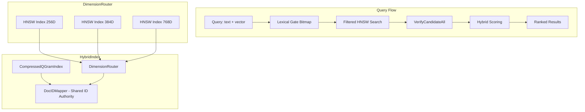

# Phase 8.5: Hybrid Index Integration Plan

## Overview

Integrate the HNSW vector index with the qgram lexical index for **hard hybrid search** - where lexical truth-set is authoritative and vectors only rank within that set.

**Key Principle:** No semantic-only escapes. Eligibility is enforced by lexical verification.

---

## Architecture



---

## Package Structure

```
GoKitt/pkg/hybrid/
├── hybrid.go              # HybridIndex, HybridConfig, core types
├── hybrid_test.go         # Integration tests
├── dimension_router.go    # Multi-dimension HNSW routing
├── dimension_router_test.go
├── gate.go                # Lexical gate bitmap generation
├── gate_test.go
├── scorer.go              # Hybrid scoring with vector similarity
└── scorer_test.go
```

---

## Core Types

### HybridConfig

```go
type HybridConfig struct {
    // HNSW parameters
    M              int     // Max neighbors per level (default: 16)
    EfConstruction int     // Construction beam width (default: 200)
    EfSearch       int     // Search beam width (default: 50)
    
    // Hybrid parameters
    K                 int     // Number of results to return
    Hard              bool    // Hard mode: lexical gate required (default: true)
    GateMaxCandidates int     // Max candidates before gate becomes selective (default: 10000)
    
    // Expansion loop
    FetchCap        int     // Max candidates to fetch from HNSW (default: 1000)
    ExpansionFactor int     // Multiply k by this when re-fetching (default: 4)
    MaxExpansions   int     // Max expansion iterations (default: 3)
    
    // Score normalization (see Step D)
    ScoreConfig HybridScoreConfig
    
    // Lexical config (passed through)
    LexicalConfig qgram.SearchConfig
}

// HybridScoreConfig controls score normalization for blending
type HybridScoreConfig struct {
    Alpha      float64 // Vector weight (0.0-1.0, default: 0.3)
    LexicalCap float64 // Cap for lexical score normalization (default: 10.0)
    VecMin     float64 // Min cosine for normalization (default: -1.0)
    VecMax     float64 // Max cosine for normalization (default: 1.0)
}
```

### HybridIndex

```go
type HybridIndex struct {
    Lex *qgram.CompressedQGramIndex   // Lexical index (authoritative for metadata)
    Vec *DimensionRouter               // Multi-dimension HNSW router
    
    // Convenience accessor
    Mapper *qgram.DocIDMapper          // Alias to Lex.Mapper
}

// DimensionRouter manages per-dimension HNSW indexes
type DimensionRouter struct {
    Indexes map[int]*hnsw.Index  // dimension -> HNSW index
    M       int
    EfCon   int
    Metric  hnsw.Metric
}
```

### HybridResult

```go
type HybridResult struct {
    DocID    string
    Score    float64  // Combined normalized score (for ranking)
    LexScore float64  // Raw lexical: BM25 + coverage + proximity
    VecScore float32  // Raw vector: cosine similarity
    LexNorm  float64  // Normalized lexical [0, 1]
    VecNorm  float64  // Normalized vector [0, 1]
    Coverage float64  // Fraction of clauses matched
}
```

---

## Ingestion API

### Upsert

```go
func (hx *HybridIndex) Upsert(docID string, fields map[string]string, vec []float32) error {
    // 1. Get or assign uint32 ID from shared mapper
    uid := hx.Lex.Mapper.GetOrAssign(docID)
    
    // 2. Index in lexical (existing API)
    hx.Lex.IndexDocumentScoped(docID, fields, narrativeID, folderPath)
    
    // 3. Route to correct dimension HNSW
    dim := len(vec)
    idx, err := hx.Vec.GetOrCreateIndex(dim)
    if err != nil {
        return err
    }
    
    // 4. Add to HNSW (will reject duplicate ID - good invariant)
    return idx.AddPoint(uid, vec)
}
```

### Delete

```go
func (hx *HybridIndex) Delete(docID string) {
    uid := hx.Lex.Mapper.Get(docID)
    if uid == 0 {
        return
    }
    
    // 1. Lazy delete in lexical (sets Deleted bitmap)
    hx.Lex.LazyDelete(docID)
    
    // 2. Soft delete in all HNSW indexes
    hx.Vec.DeletePointAll(uid)
}
```

---

## Query Path: Gate → Filtered ANN → Verify/Score

### Step A: Lexical Gate Bitmap

```go
func (hx *HybridIndex) buildGateBitmap(clauses []qgram.Clause, config HybridConfig) *roaring.Bitmap {
    var clauseBitmaps []*roaring.Bitmap
    
    for _, clause := range clauses {
        // Use AdaptiveGramSelection to get selective grams
        grams := hx.Lex.AdaptiveGramSelection(clause.Pattern, config.GateMaxCandidates)
        if len(grams) == 0 {
            continue // Clause cannot match
        }
        
        // Intersect grams for this clause
        var clauseBM *roaring.Bitmap
        for _, gram := range grams {
            postings := hx.Lex.GramPostings[gram]
            if postings == nil {
                clauseBM = nil
                break
            }
            if clauseBM == nil {
                clauseBM = postings.DocIDs.Clone()
            } else {
                clauseBM.And(postings.DocIDs)
            }
        }
        
        if clauseBM != nil && !clauseBM.IsEmpty() {
            clauseBitmaps = append(clauseBitmaps, clauseBM)
        }
    }
    
    // OR across clauses (multi-clause = union for recall)
    result := roaring.New()
    for _, bm := range clauseBitmaps {
        result.Or(bm)
    }
    
    // Apply lazy delete filter
    if !hx.Lex.Deleted.IsEmpty() {
        result.AndNot(hx.Lex.Deleted)
    }
    
    return result
}
```

### Step B: Filtered HNSW Search (Result-Filtered, Not Traversal-Filtered)

**Important:** The HNSW `SearchKNNFiltered` applies the filter during **result collection**, not during graph traversal. The graph is explored normally, then results are filtered. It compensates by expanding `ef` to `k*4` (or `efConstruction`, whichever is larger).

**Expectation:** ANN explores the graph normally, then yields the top-k that are `(not deleted) AND pass the allowed-ID predicate`.

```go
func (hx *HybridIndex) searchFiltered(
    queryVec []float32,
    k int,
    ef int,
    allowed *roaring.Bitmap,
) []hnsw.Result {
    dim := len(queryVec)
    idx := hx.Vec.Indexes[dim]
    if idx == nil {
        return nil
    }
    
    // Filter predicate: check if ID is in allowed bitmap
    // Applied during result collection, NOT during traversal
    filter := func(id uint32) bool {
        return allowed.Contains(id)
    }
    
    // SearchKNNFiltered expands ef to k*4 internally
    return idx.SearchKNNFiltered(queryVec, k, filter)
}
```

### Step C: Expansion Loop

Because PhraseHard can reject neighbors, we need an expansion loop:

```go
func (hx *HybridIndex) fetchWithExpansion(
    queryVec []float32,
    clauses []qgram.Clause,
    config HybridConfig,
    allowed *roaring.Bitmap,
) []HybridResult {
    k := config.K
    ef := config.EfSearch
    
    var results []HybridResult
    expansions := 0
    
    for expansions < config.MaxExpansions {
        // Fetch from HNSW
        candidates := hx.searchFiltered(queryVec, k*config.ExpansionFactor, ef, allowed)
        if len(candidates) == 0 {
            break
        }
        
        // Verify and score
        results = hx.verifyAndScore(candidates, clauses, config)
        
        if len(results) >= config.K {
            break // Got enough
        }
        
        // Expand search
        k *= config.ExpansionFactor
        ef *= 2
        expansions++
    }
    
    return results
}
```

### Step D: Hybrid Scoring (Full Lexical Score + Normalized Blend)

**Important:** The lexical score is NOT just BM25. It's the full score from [`computeDocScore`](GoKitt/pkg/qgram/scorer.go:219):
- BM25-ish saturation (`K1`, `B` parameters)
- Coverage multiplier (`CoverageEpsilon^CoverageLambda`)
- Proximity multiplier (segment mask overlap, `ProximityAlpha`)

**Normalization Required:** 
- Lexical score is unbounded (can be very large for rare terms)
- Vector similarity (cosine) is bounded [-1, 1]

We normalize both terms before convex blending:

```go
// HybridScoreConfig controls score normalization
type HybridScoreConfig struct {
    Alpha       float64 // Vector weight (0.0-1.0, default: 0.3)
    LexicalCap  float64 // Cap for lexical score normalization (default: 10.0)
    VecMin      float64 // Min cosine for normalization (default: -1.0)
    VecMax      float64 // Max cosine for normalization (default: 1.0)
}

func (hx *HybridIndex) verifyAndScore(
    candidates []hnsw.Result,
    clauses []qgram.Clause,
    config HybridConfig,
) []HybridResult {
    qv := qgram.NewQueryVerifier(clauses)
    corpusStats := hx.Lex.GetCorpusStats()
    
    var results []HybridResult
    
    // Pre-compute IDFs
    idfs := hx.computeIDFs(clauses)
    
    for _, cand := range candidates {
        docID := hx.Lex.Mapper.GetString(cand.ID)
        if docID == "" {
            continue
        }
        
        // Verify all clauses (Aho-Corasick one-pass)
        matches, matchedCount := hx.Lex.VerifyCandidateAll(docID, &qv)
        if matchedCount == 0 {
            continue // Failed verification
        }
        
        // PhraseHard rejection
        if config.LexicalConfig.PhraseHard {
            reject := false
            for i, clause := range clauses {
                if clause.Type == qgram.PhraseClause && matches[i] == nil {
                    reject = true
                    break
                }
            }
            if reject {
                continue
            }
        }
        
        // Compute FULL lexical score (BM25 + coverage + proximity)
        lexScore := hx.computeDocScore(docID, matches, matchedCount, idfs, config.LexicalConfig, corpusStats)
        
        // Normalize scores before blending
        // Lexical: cap and normalize to [0, 1]
        lexNorm := math.Min(lexScore, config.ScoreConfig.LexicalCap) / config.ScoreConfig.LexicalCap
        
        // Vector: normalize cosine from [VecMin, VecMax] to [0, 1]
        vecScore := float64(cand.Score)
        vecNorm := (vecScore - config.ScoreConfig.VecMin) / (config.ScoreConfig.VecMax - config.ScoreConfig.VecMin)
        
        // Convex blend
        combinedNorm := lexNorm*(1.0-config.ScoreConfig.Alpha) + vecNorm*config.ScoreConfig.Alpha
        
        // Store both raw and normalized for debugging/ranking
        results = append(results, HybridResult{
            DocID:       docID,
            Score:       combinedNorm, // Normalized combined score for ranking
            LexScore:    lexScore,     // Raw lexical score (for debugging)
            VecScore:    cand.Score,   // Raw vector similarity (for debugging)
            LexNorm:     lexNorm,      // Normalized lexical [0,1]
            VecNorm:     vecNorm,      // Normalized vector [0,1]
            Coverage:    float64(matchedCount) / float64(len(clauses)),
        })
    }
    
    // Sort by combined normalized score
    sort.Slice(results, func(i, j int) bool {
        return results[i].Score > results[j].Score
    })
    
    return results
}
```

**Score Breakdown (for HybridResult):**

```go
type HybridResult struct {
    DocID    string
    Score    float64  // Combined normalized score (for ranking)
    LexScore float64  // Raw lexical: BM25 + coverage + proximity
    VecScore float32  // Raw vector: cosine similarity
    LexNorm  float64  // Normalized lexical [0, 1]
    VecNorm  float64  // Normalized vector [0, 1]
    Coverage float64  // Fraction of clauses matched
}
```

---

## Dimension Router

```go
package hybrid

import "github.com/kittclouds/gokitt/pkg/hnsw"

type DimensionRouter struct {
    Indexes map[int]*hnsw.Index
    M       int
    EfCon   int
    Metric  hnsw.Metric
}

func NewDimensionRouter(m, efCon int, metric hnsw.Metric) *DimensionRouter {
    return &DimensionRouter{
        Indexes: make(map[int]*hnsw.Index),
        M:       m,
        EfCon:   efCon,
        Metric:  metric,
    }
}

func (dr *DimensionRouter) GetOrCreateIndex(dim int) (*hnsw.Index, error) {
    if idx, ok := dr.Indexes[dim]; ok {
        return idx, nil
    }
    
    // Validate dimension (64-1536)
    if dim < 64 || dim > 1536 {
        return nil, fmt.Errorf("dimension %d out of range [64, 1536]", dim)
    }
    
    idx := hnsw.NewIndex(dr.M, dr.EfCon, dr.Metric)
    dr.Indexes[dim] = idx
    return idx, nil
}

func (dr *DimensionRouter) DeletePointAll(id uint32) {
    for _, idx := range dr.Indexes {
        idx.DeletePoint(id)
    }
}

func (dr *DimensionRouter) GetIndex(dim int) *hnsw.Index {
    return dr.Indexes[dim]
}
```

---

## Test Cases

### 1. ID Consistency Test

```go
func TestIDConsistency(t *testing.T) {
    hx := NewHybridIndex(DefaultHybridConfig())
    
    // Upsert document
    err := hx.Upsert("doc1", map[string]string{"content": "hello world"}, []float32{0.1, 0.2, ...})
    require.NoError(t, err)
    
    // Verify uid assignment
    uid := hx.Lex.Mapper.Get("doc1")
    assert.NotZero(t, uid)
    
    // Verify vector indexed under same uid
    vec, ok := hx.Vec.Indexes[256].GetVector(uid)
    assert.True(t, ok)
    assert.NotNil(t, vec)
    
    // Query returns correct docID string
    results := hx.Search("hello", queryVec, DefaultHybridConfig())
    assert.Len(t, results, 1)
    assert.Equal(t, "doc1", results[0].DocID)
}
```

### 2. Hard Constraint Test

```go
func TestHardConstraintPhraseMiss(t *testing.T) {
    hx := NewHybridIndex(DefaultHybridConfig())
    
    // Index two documents with similar vectors
    vec := []float32{0.5, 0.5, ...} // Same vector
    
    hx.Upsert("doc1", map[string]string{"content": "machine learning algorithms"}, vec)
    hx.Upsert("doc2", map[string]string{"content": "deep neural networks"}, vec)
    
    // Query with phrase that only matches doc1
    config := DefaultHybridConfig()
    config.LexicalConfig.PhraseHard = true
    
    results := hx.Search("\"machine learning\"", vec, config)
    
    // Only doc1 should appear despite identical vectors
    assert.Len(t, results, 1)
    assert.Equal(t, "doc1", results[0].DocID)
}
```

### 3. Delete Test

```go
func TestDeleteExclusion(t *testing.T) {
    hx := NewHybridIndex(DefaultHybridConfig())
    
    vec := []float32{0.5, 0.5, ...}
    hx.Upsert("doc1", map[string]string{"content": "hello world"}, vec)
    
    // Delete
    hx.Delete("doc1")
    
    // Lexical gate should exclude via Deleted bitmap
    results := hx.Search("hello", vec, DefaultHybridConfig())
    assert.Len(t, results, 0)
    
    // HNSW should have tombstone
    uid := hx.Lex.Mapper.Get("doc1")
    idx := hx.Vec.Indexes[len(vec)]
    node, ok := idx.Nodes[uid]
    assert.True(t, ok)
    assert.True(t, node.Deleted)
}
```

### 4. Dimension Router Test

```go
func TestDimensionRouter(t *testing.T) {
    dr := NewDimensionRouter(16, 200, hnsw.Cosine)
    
    // 256D document
    vec256 := make([]float32, 256)
    idx256, err := dr.GetOrCreateIndex(256)
    require.NoError(t, err)
    idx256.AddPoint(1, vec256)
    
    // 384D document
    vec384 := make([]float32, 384)
    idx384, err := dr.GetOrCreateIndex(384)
    require.NoError(t, err)
    idx384.AddPoint(2, vec384)
    
    // Verify separate indexes
    assert.Len(t, dr.Indexes, 2)
    assert.NotNil(t, dr.Indexes[256])
    assert.NotNil(t, dr.Indexes[384])
    
    // Dimension mismatch rejection
    err = idx256.AddPoint(3, vec384)
    assert.ErrorIs(t, err, hnsw.ErrDimensionMismatch)
}
```

---

## Integration Points

### Existing Code to Reuse

| Component | Location | Usage |
|-----------|----------|-------|
| [`DocIDMapper`](GoKitt/pkg/qgram/compressed_postings.go:14) | `qgram/compressed_postings.go` | Shared ID authority |
| [`CompressedQGramIndex`](GoKitt/pkg/qgram/compressed_postings.go:145) | `qgram/compressed_postings.go` | Lexical index |
| [`VerifyCandidateAll`](GoKitt/pkg/qgram/query_verifier.go:43) | `qgram/query_verifier.go` | Aho-Corasick verification |
| [`SearchKNNFiltered`](GoKitt/pkg/hnsw/index.go:228) | `hnsw/index.go` | Filtered ANN search |
| [`DeletePoint`](GoKitt/pkg/hnsw/index.go:267) | `hnsw/index.go` | Soft delete |
| [`SearchConfig`](GoKitt/pkg/qgram/scorer.go:13) | `qgram/scorer.go` | Lexical scoring config |

### New Code Required

| Component | Purpose |
|-----------|---------|
| `hybrid.go` | HybridIndex, HybridConfig, Upsert, Delete, Search |
| `dimension_router.go` | Multi-dimension HNSW management |
| `gate.go` | Lexical gate bitmap generation |
| `scorer.go` | Hybrid scoring (BM25 + vector similarity) |

---

## Why Before Phase 9 Serialization

Once HNSW is serialized into GoSQLite vec, we commit to:

1. **docID32 stability** - The uint32 ID mapping must be consistent across lexical and vector indexes
2. **Delete/tombstone representation** - Both indexes must agree on deleted state
3. **Per-dimension index layout** - Serialization format must handle multiple dimensions
4. **Allowed ID sets** - Bitmap/slice representation for filtered search

Building the hybrid integration first validates these invariants before locking them into a serialization format.

---

## Implementation Order

1. **Dimension Router** - Foundation for multi-dimension support
2. **HybridIndex Types** - Core structs and config
3. **Upsert/Delete API** - Ingestion path
4. **Gate Bitmap** - Lexical candidate generation
5. **Hybrid Scoring** - Combined BM25 + vector scoring
6. **Search API** - Full query path with expansion loop
7. **Tests** - All 4 test cases above

---

## Performance Considerations

### Gate Bitmap Efficiency

- Use [`AdaptiveGramSelection`](GoKitt/pkg/qgram/compressed_postings.go:470) with `GateMaxCandidates` to limit gate size
- Roaring bitmaps provide SIMD-optimized intersection via [`And()`](GoKitt/pkg/qgram/compressed_postings.go:137)
- Lazy delete filter via [`AndNot()`](GoKitt/pkg/qgram/compressed_postings.go:436) is zero-allocation

### HNSW Filtered Search

- [`SearchKNNFiltered`](GoKitt/pkg/hnsw/index.go:228) expands `ef` by 4x to account for filtering
- Filter predicate is called during result collection, not during graph traversal
- Deleted nodes are skipped in result loop

### Expansion Loop

- Start with `k * 4` candidates
- Double `ef` on each expansion
- Cap at `MaxExpansions` (default 3) to prevent runaway queries

---

## API Summary

```go
// Create
hx := hybrid.NewHybridIndex(hybrid.DefaultHybridConfig())

// Ingest
hx.Upsert("doc1", map[string]string{"content": "hello world"}, vec256)
hx.Upsert("doc2", map[string]string{"content": "foo bar"}, vec384)

// Query
results := hx.Search("hello", queryVec, config)

// Delete
hx.Delete("doc1")
```
