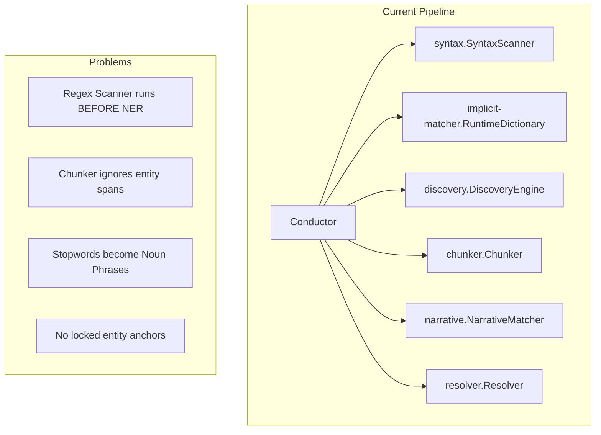
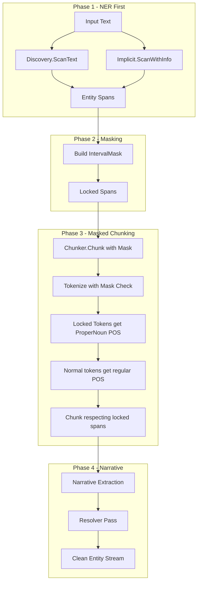

# NER-Native CST Pipeline Implementation Plan

## Executive Summary

This document outlines the architectural redesign of the text processing pipeline to be **NER-Native**. The current system has a "rats nest" of legacy regex scanners (`syntax.go`) competing with modern NER (`Discovery`/`Implicit`), causing race conditions where stopwords are incorrectly chunked as Noun Phrases and promoted to entities.

## Current Architecture Analysis

### Package Dependency Graph



### Current Scan Flow in [`conductor.go`](GoKitt/pkg/scanner/conductor/conductor.go:85)

```go
func (c *Conductor) Scan(text string) ScanResult {
    // 1. Discovery Virus - Unsupervised NER
    discoveryCandidates := c.discoveryEngine.ScanText(text)
    
    // 2. Syntax Pass - LEGACY REGEX SCANNER
    synMatches := c.syntaxScanner.Scan(text)  // <-- PROBLEM: Runs too late
    
    // 3. Implicit Matcher Pass - Dictionary entities
    implicitMatches := c.implicitScanner.ScanWithInfo(text)
    
    // 4. Merge Streams - Complex overlap resolution
    // 5. Chunker Pass - NO MASKING
    chunkResult := c.chunker.Chunk(text)  // <-- PROBLEM: No entity awareness
    
    // 6. Narrative Pass
    // 7. Resolver Pass
}
```

### Key Files Analyzed

| File | Purpose | Lines | Issue |
|------|---------|-------|-------|
| [`conductor.go`](GoKitt/pkg/scanner/conductor/conductor.go) | Pipeline orchestrator | 373 | Runs syntax scanner, no masking |
| [`syntax.go`](GoKitt/pkg/scanner/syntax/syntax.go) | Legacy regex scanner | 45 | Competes with NER, should be removed |
| [`chunker.go`](GoKitt/pkg/scanner/chunker/chunker.go) | Phrase chunking | 442 | No mask awareness, chunks entities |
| [`engine.go`](GoKitt/pkg/scanner/discovery/engine.go) | Unsupervised NER | 100+ | Good - provides entity spans |
| [`dictionary.go`](GoKitt/pkg/implicit-matcher/dictionary.go) | Aho-Corasick matcher | 150+ | Good - provides entity spans |
| [`registry.go`](GoKitt/pkg/scanner/discovery/registry.go) | Stopword filtering | 100+ | Good - has NER stopwords |

### The Core Problem

The [`chunker.Chunk()`](GoKitt/pkg/scanner/chunker/chunker.go:184) method tokenizes and chunks text **without any awareness of already-detected entities**. This causes:

1. **"The Nuclear Bomb"** (a detected entity) gets chunked as:
   - "The" (Determiner)
   - "Nuclear" (Adjective)  
   - "Bomb" (Noun)
   
2. **"But the Raven flies."** with "Raven" as entity:
   - "But" becomes a Noun Phrase candidate
   - "the" becomes a Noun Phrase candidate
   - Both get promoted to entities incorrectly

---

## Proposed Architecture

### New Pipeline Flow



### The IntervalMask Type

```go
// IntervalMask tracks locked entity spans that cannot be split
type IntervalMask struct {
    intervals []Interval
}

type Interval struct {
    Start int
    End   int
    Kind  string  // Entity kind for POS tagging
    ID    string  // Entity ID if known
}

// Methods
func (m *IntervalMask) Add(start, end int, kind, id string)
func (m *IntervalMask) Contains(pos int) bool
func (m *IntervalMask) GetInterval(pos int) *Interval
func (m *IntervalMask) Overlaps(start, end int) bool
```

---

## Implementation Phases

### Phase 1: Create IntervalMask Type

**File:** `GoKitt/pkg/scanner/chunker/mask.go`

Create a lightweight interval tracking structure. Options:
1. **Simple slice** - O(n) lookup, fine for small texts
2. **Sorted slice with binary search** - O(log n) lookup
3. **Interval tree** - Overkill for this use case

**Recommendation:** Start with sorted slice + binary search. No external dependencies.

### Phase 2: Update Chunker API

**File:** [`GoKitt/pkg/scanner/chunker/chunker.go`](GoKitt/pkg/scanner/chunker/chunker.go:184)

```go
// OLD
func (c *Chunker) Chunk(text string) ChunkResult

// NEW
func (c *Chunker) Chunk(text string, mask *IntervalMask) ChunkResult
```

The mask can be `nil` for backward compatibility.

### Phase 3: Update Tokenizer

**File:** [`GoKitt/pkg/scanner/chunker/chunker.go:201`](GoKitt/pkg/scanner/chunker/chunker.go:201)

Modify [`tokenize()`](GoKitt/pkg/scanner/chunker/chunker.go:201) to:
1. Check if current position is inside a masked interval
2. If yes: create single token for entire span, skip to end
3. If no: tokenize normally

```go
func (c *Chunker) tokenizeWithMask(text string, mask *IntervalMask) []TextRange {
    if mask == nil {
        return c.tokenize(text)  // Backward compatible
    }
    
    tokens := make([]TextRange, 0, len(text)/6)
    i := 0
    
    for i < len(text) {
        // Check if position i is inside a masked interval
        if interval := mask.GetInterval(i); interval != nil {
            // Create single token for entire entity span
            tokens = append(tokens, NewRange(interval.Start, interval.End))
            i = interval.End
            continue
        }
        
        // Normal tokenization logic...
    }
    return tokens
}
```

### Phase 4: Update POS Tagger

**File:** `GoKitt/pkg/scanner/chunker/tagger.go` (if exists) or inline in chunker

When a token corresponds to a masked interval:
- Force POS to `ProperNoun`
- Store entity kind in token metadata (optional extension)

### Phase 5: Refactor Conductor

**File:** [`GoKitt/pkg/scanner/conductor/conductor.go`](GoKitt/pkg/scanner/conductor/conductor.go)

```go
func (c *Conductor) Scan(text string) ScanResult {
    // STEP 1: NER FIRST - Collect all entity spans
    var entitySpans []EntitySpan
    
    // 1a. Discovery candidates
    discoveryCandidates := c.discoveryEngine.ScanText(text)
    for _, cand := range discoveryCandidates {
        entitySpans = append(entitySpans, EntitySpan{
            Start: cand.Start,
            End:   cand.End,
            Kind:  cand.Kind,
            Text:  cand.Text,
        })
    }
    
    // 1b. Implicit dictionary matches
    if c.implicitScanner != nil {
        implicitHits := c.implicitScanner.ScanWithInfo(text)
        for _, hit := range implicitHits {
            if c.discoveryEngine.Registry.IsIgnored(hit.MatchedText) {
                continue  // Stopword filter
            }
            entitySpans = append(entitySpans, EntitySpan{...})
        }
    }
    
    // STEP 2: BUILD MASK
    mask := chunker.NewIntervalMask()
    for _, span := range entitySpans {
        mask.Add(span.Start, span.End, span.Kind, span.ID)
    }
    
    // STEP 3: MASKED CHUNKING
    chunkResult := c.chunker.Chunk(text, mask)
    
    // STEP 4: NARRATIVE (unchanged)
    // STEP 5: RESOLVER (unchanged)
}
```

### Phase 6: Remove Syntax Scanner

**Files to modify:**
1. [`GoKitt/pkg/scanner/conductor/conductor.go`](GoKitt/pkg/scanner/conductor/conductor.go) - Remove `syntaxScanner` field and usage
2. [`GoKitt/pkg/scanner/syntax/syntax.go`](GoKitt/pkg/scanner/syntax/syntax.go) - DELETE or keep only `SyntaxMatch` DTO

**Migration path for explicit entities:**
- `[[WikiLinks]]` and `[KIND:Entity]` syntax should be handled by a **pre-processor** that:
  1. Parses explicit syntax
  2. Adds to entity spans
  3. Strips syntax markers from text before chunking

---

## Verification Plan

### Unit Tests

#### Test 1: `TestChunker_WithMask`

```go
func TestChunker_WithMask(t *testing.T) {
    ch := chunker.New()
    text := "The Nuclear Bomb exploded"
    
    // "Nuclear Bomb" is a detected entity (positions 4-16)
    mask := chunker.NewIntervalMask()
    mask.Add(4, 16, "WEAPON", "nuclear-bomb")
    
    result := ch.Chunk(text, mask)
    
    // Verify "Nuclear Bomb" is ONE token, not three
    foundEntityToken := false
    for _, tok := range result.Tokens {
        if tok.Text == "Nuclear Bomb" {
            foundEntityToken = true
            if tok.POS != chunker.ProperNoun {
                t.Errorf("Expected ProperNoun for entity token, got %v", tok.POS)
            }
        }
    }
    
    if !foundEntityToken {
        t.Error("Expected to find 'Nuclear Bomb' as single token")
    }
}
```

#### Test 2: `TestConductor_Stopwords`

```go
func TestConductor_Stopwords(t *testing.T) {
    c, _ := New()
    defer c.Close()
    
    // Seed "Raven" as known entity
    c.discoveryEngine.Registry.AddToken("Raven")
    stats := c.discoveryEngine.Registry.GetStats("Raven")
    stats.Status = discovery.StatusPromoted
    kind := implicitmatcher.KindCharacter
    stats.InferredKind = &kind
    
    text := "But the Raven flies."
    result := c.Scan(text)
    
    // Verify ONLY "Raven" is an entity
    for _, m := range result.Syntax {
        if m.Kind == syntax.KindEntity {
            if m.Label != "Raven" {
                t.Errorf("Unexpected entity: %s (expected only 'Raven')", m.Label)
            }
        }
    }
    
    // Verify "But" and "the" are NOT entities
    entityLabels := make(map[string]bool)
    for _, m := range result.Syntax {
        if m.Kind == syntax.KindEntity {
            entityLabels[m.Label] = true
        }
    }
    
    if entityLabels["But"] {
        t.Error("'But' should NOT be an entity")
    }
    if entityLabels["the"] {
        t.Error("'the' should NOT be an entity")
    }
}
```

### Manual Verification

1. Run system on problematic text: `"But the Raven flies to the Nuclear Bomb."`
2. Expected graph nodes: `["Raven", "Nuclear Bomb"]`
3. Forbidden nodes: `["But", "the", "to", "flies"]`

---

## Risk Assessment

| Risk | Impact | Mitigation |
|------|--------|------------|
| Breaking existing tests | High | Run full test suite after each phase |
| Performance regression | Medium | Benchmark before/after |
| WikiLink syntax migration | Medium | Create pre-processor for explicit syntax |
| Interval overlap bugs | Low | Comprehensive unit tests for mask |

---

## Dependencies

### No New External Dependencies

The `IntervalMask` will be implemented using standard Go slices with binary search. This avoids:
- Roaring bitmap complexity
- External dependency management
- WASM compatibility concerns

### Internal Dependencies

```
chunker.IntervalMask  <-- new
    |
    v
conductor.Conductor   <-- modified
    |
    v
discovery.Engine      <-- unchanged
implicit-matcher      <-- unchanged
```

---

## Timeline

| Phase | Description | Priority |
|-------|-------------|----------|
| 1 | Create IntervalMask type | High |
| 2 | Update Chunker API | High |
| 3 | Update tokenizer | High |
| 4 | Update POS tagger | Medium |
| 5 | Refactor Conductor | High |
| 6 | Remove syntax scanner | Medium |
| 7 | Write verification tests | High |
| 8 | Manual verification | Medium |

---

## Questions for User

1. **WikiLink Migration:** Should explicit `[[WikiLink]]` syntax be handled by a pre-processor, or should we create a dedicated "Explicit Entity Scanner" that feeds the same mask?

2. **POS for Entities:** Should locked entity tokens always be `ProperNoun`, or should we use the entity kind to inform the POS (e.g., `Location` → `ProperNoun`, `Object` → `Noun`)?

3. **Mask Persistence:** Should the mask be part of the `ChunkResult` for debugging/visualization purposes?
