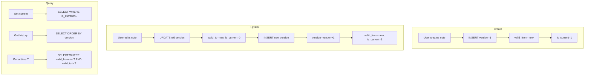

# SQLite Temporal Versioning Architecture

## Executive Summary

Replace NebulaDB's versioning with a native SQLite temporal table system. This enables:
- Full version history for notes (ProseMirror/Milkdown integration)
- Chat thread/message versioning for OpenRouter LLM responses
- Point-in-time queries and audit trails
- Complete Nebula elimination from the codebase

---

## 1. Current State Analysis

### 1.1 Existing SQLite Schema ([`sqlite_store.go`](GoKitt/internal/store/sqlite_store.go:23))

```sql
-- Current notes table (no versioning)
CREATE TABLE IF NOT EXISTS notes (
    id TEXT PRIMARY KEY,
    world_id TEXT NOT NULL,
    title TEXT NOT NULL,
    content TEXT NOT NULL,
    markdown_content TEXT,
    folder_id TEXT,
    entity_kind TEXT,
    entity_subtype TEXT,
    is_entity INTEGER DEFAULT 0,
    is_pinned INTEGER DEFAULT 0,
    favorite INTEGER DEFAULT 0,
    owner_id TEXT,
    narrative_id TEXT,
    "order" REAL,
    created_at INTEGER NOT NULL,
    updated_at INTEGER NOT NULL
);
```

### 1.2 Chat Messages (Currently in CozoDB)

From [`ai-chat.service.ts`](src/app/lib/services/ai-chat.service.ts:69):
```typescript
interface ChatMessage {
    id: string;
    sessionId: string;
    role: 'user' | 'assistant' | 'system';
    content: string;
    createdAt: number;
    narrativeId?: string;
    metadata?: Record<string, unknown>;
}
```

### 1.3 Nebula References to Remove

- [`src/app/lib/nebula/db.ts`](src/app/lib/nebula/db.ts) - Nebula database wrapper
- [`src/app/lib/nebula-db/`](src/app/lib/nebula-db/) - Full Nebula package
- Comments referencing "Dexie/Nebula" in Go files

---

## 2. Temporal Table Design Patterns

Based on Simon Willison's SQLite history article and the temporal tables article:

### 2.1 Pattern A: Same-Table Versioning (Recommended for Notes)

**Pros**: Single table, simple queries for current state
**Cons**: Larger table, requires `is_current` filter

```sql
CREATE TABLE notes (
    id TEXT NOT NULL,
    version INTEGER NOT NULL DEFAULT 1,
    world_id TEXT NOT NULL,
    title TEXT NOT NULL,
    content TEXT NOT NULL,
    markdown_content TEXT,
    folder_id TEXT,
    entity_kind TEXT,
    entity_subtype TEXT,
    is_entity INTEGER DEFAULT 0,
    is_pinned INTEGER DEFAULT 0,
    favorite INTEGER DEFAULT 0,
    owner_id TEXT,
    narrative_id TEXT,
    "order" REAL,
    created_at INTEGER NOT NULL,
    updated_at INTEGER NOT NULL,
    valid_from INTEGER NOT NULL,
    valid_to INTEGER,
    is_current INTEGER DEFAULT 1,
    change_reason TEXT,
    PRIMARY KEY (id, version)
);
```

### 2.2 Pattern B: Separate History Table (Recommended for Chat)

**Pros**: Clean separation, current table stays small
**Cons**: Requires join for full history

```sql
-- Current state (fast queries)
CREATE TABLE chat_messages (
    id TEXT PRIMARY KEY,
    thread_id TEXT NOT NULL,
    role TEXT NOT NULL,
    content TEXT NOT NULL,
    created_at INTEGER NOT NULL,
    narrative_id TEXT,
    metadata TEXT
);

-- Version history (audit trail)
CREATE TABLE chat_message_history (
    id TEXT NOT NULL,
    version INTEGER NOT NULL,
    thread_id TEXT NOT NULL,
    role TEXT NOT NULL,
    content TEXT NOT NULL,
    created_at INTEGER NOT NULL,
    valid_from INTEGER NOT NULL,
    valid_to INTEGER,
    is_current INTEGER DEFAULT 1,
    change_type TEXT,  -- 'create', 'edit', 'delete'
    PRIMARY KEY (id, version)
);
```

---

## 3. Recommended Architecture

### 3.1 Notes: Same-Table Temporal Versioning

Notes are edited frequently; same-table keeps queries simple:

```sql
-- Drop old table and recreate with versioning
DROP TABLE IF EXISTS notes;

CREATE TABLE notes (
    -- Composite primary key for versioning
    id TEXT NOT NULL,
    version INTEGER NOT NULL DEFAULT 1,
    
    -- World context
    world_id TEXT NOT NULL,
    narrative_id TEXT,
    folder_id TEXT,
    
    -- Content
    title TEXT NOT NULL,
    content TEXT NOT NULL,
    markdown_content TEXT,
    
    -- Entity linkage
    entity_kind TEXT,
    entity_subtype TEXT,
    is_entity INTEGER DEFAULT 0,
    
    -- UI state
    is_pinned INTEGER DEFAULT 0,
    favorite INTEGER DEFAULT 0,
    "order" REAL,
    owner_id TEXT,
    
    -- Timestamps
    created_at INTEGER NOT NULL,
    updated_at INTEGER NOT NULL,
    
    -- Temporal columns
    valid_from INTEGER NOT NULL DEFAULT (strftime('%s', 'now') * 1000),
    valid_to INTEGER,
    is_current INTEGER DEFAULT 1,
    change_reason TEXT,  -- 'user_edit', 'auto_save', 'entity_link'
    
    PRIMARY KEY (id, version)
);

-- Indexes for common queries
CREATE INDEX idx_notes_current ON notes(id) WHERE is_current = 1;
CREATE INDEX idx_notes_folder ON notes(folder_id) WHERE is_current = 1;
CREATE INDEX idx_notes_narrative ON notes(narrative_id) WHERE is_current = 1;
CREATE INDEX idx_notes_history ON notes(id, valid_from);
```

### 3.2 Chat: Separate History Table

Chat messages are mostly immutable; only `content` changes during streaming:

```sql
-- Threads (new)
CREATE TABLE chat_threads (
    id TEXT PRIMARY KEY,
    narrative_id TEXT,
    title TEXT,
    created_at INTEGER NOT NULL,
    updated_at INTEGER NOT NULL,
    metadata TEXT
);

-- Current messages
CREATE TABLE chat_messages (
    id TEXT PRIMARY KEY,
    thread_id TEXT NOT NULL,
    role TEXT NOT NULL CHECK(role IN ('user', 'assistant', 'system', 'tool')),
    content TEXT NOT NULL,
    created_at INTEGER NOT NULL,
    narrative_id TEXT,
    metadata TEXT,  -- JSON: { model, tokens, toolCalls, etc. }
    
    -- For streaming updates
    version INTEGER DEFAULT 1,
    is_streaming INTEGER DEFAULT 0
);

-- Message history (for edit tracking)
CREATE TABLE chat_message_versions (
    id TEXT NOT NULL,
    version INTEGER NOT NULL,
    thread_id TEXT NOT NULL,
    role TEXT NOT NULL,
    content TEXT NOT NULL,
    created_at INTEGER NOT NULL,
    valid_from INTEGER NOT NULL,
    valid_to INTEGER,
    is_current INTEGER DEFAULT 1,
    
    PRIMARY KEY (id, version)
);

-- Indexes
CREATE INDEX idx_chat_messages_thread ON chat_messages(thread_id);
CREATE INDEX idx_chat_versions_thread ON chat_message_versions(thread_id);
```

### 3.3 Entities: Add Version Tracking

Entities change less frequently but benefit from audit trails:

```sql
CREATE TABLE entities (
    id TEXT NOT NULL,
    version INTEGER NOT NULL DEFAULT 1,
    label TEXT NOT NULL,
    kind TEXT NOT NULL,
    subtype TEXT,
    aliases TEXT,  -- JSON array
    first_note TEXT,
    total_mentions INTEGER DEFAULT 0,
    narrative_id TEXT,
    created_by TEXT DEFAULT 'user',
    created_at INTEGER NOT NULL,
    updated_at INTEGER NOT NULL,
    
    -- Temporal
    valid_from INTEGER NOT NULL DEFAULT (strftime('%s', 'now') * 1000),
    valid_to INTEGER,
    is_current INTEGER DEFAULT 1,
    
    PRIMARY KEY (id, version)
);

CREATE INDEX idx_entities_current ON entities(id) WHERE is_current = 1;
CREATE INDEX idx_entities_label ON entities(label) WHERE is_current = 1;
```

---

## 4. Trigger-Based Automation

### 4.1 Note Version Trigger

Automatically archive old version on update:

```sql
CREATE TRIGGER archive_note_version
BEFORE UPDATE ON notes
FOR EACH ROW
BEGIN
    -- Close old version
    UPDATE notes SET
        valid_to = (strftime('%s', 'now') * 1000),
        is_current = 0
    WHERE id = OLD.id AND is_current = 1;
    
    -- Insert new version with incremented version number
    -- (This happens automatically via the UPDATE statement)
END;
```

### 4.2 Chat Message Version Trigger

```sql
CREATE TRIGGER archive_chat_version
BEFORE UPDATE ON chat_messages
FOR EACH ROW
WHEN OLD.content != NEW.content
BEGIN
    INSERT INTO chat_message_versions (
        id, version, thread_id, role, content, 
        created_at, valid_from, valid_to, is_current
    ) VALUES (
        OLD.id, OLD.version, OLD.thread_id, OLD.role, OLD.content,
        OLD.created_at, 
        (SELECT created_at FROM chat_messages WHERE id = OLD.id),
        (strftime('%s', 'now') * 1000),
        0
    );
END;
```

---

## 5. Go Models Update

### 5.1 Updated Note Model ([`models.go`](GoKitt/internal/store/models.go:7))

```go
// Note represents a versioned document in the store.
type Note struct {
    ID              string  `json:"id"`
    Version         int     `json:"version"`
    WorldID         string  `json:"worldId"`
    Title           string  `json:"title"`
    Content         string  `json:"content"`
    MarkdownContent string  `json:"markdownContent"`
    FolderID        string  `json:"folderId"`
    EntityKind      string  `json:"entityKind"`
    EntitySubtype   string  `json:"entitySubtype"`
    IsEntity        bool    `json:"isEntity"`
    IsPinned        bool    `json:"isPinned"`
    Favorite        bool    `json:"favorite"`
    OwnerID         string  `json:"ownerId"`
    NarrativeID     string  `json:"narrativeId"`
    Order           float64 `json:"order"`
    CreatedAt       int64   `json:"createdAt"`
    UpdatedAt       int64   `json:"updatedAt"`
    
    // Temporal fields
    ValidFrom     int64   `json:"validFrom"`
    ValidTo       *int64  `json:"validTo,omitempty"`
    IsCurrent     bool    `json:"isCurrent"`
    ChangeReason  string  `json:"changeReason,omitempty"`
}
```

### 5.2 New Chat Models

```go
// ChatThread represents a conversation thread.
type ChatThread struct {
    ID           string `json:"id"`
    NarrativeID  string `json:"narrativeId,omitempty"`
    Title        string `json:"title,omitempty"`
    CreatedAt    int64  `json:"createdAt"`
    UpdatedAt    int64  `json:"updatedAt"`
    Metadata     string `json:"metadata,omitempty"` // JSON
}

// ChatMessage represents a message in a thread.
type ChatMessage struct {
    ID          string `json:"id"`
    ThreadID    string `json:"threadId"`
    Role        string `json:"role"` // user, assistant, system, tool
    Content     string `json:"content"`
    CreatedAt   int64  `json:"createdAt"`
    NarrativeID string `json:"narrativeId,omitempty"`
    Metadata    string `json:"metadata,omitempty"` // JSON
    Version     int    `json:"version"`
    IsStreaming bool   `json:"isStreaming"`
}

// ChatMessageVersion represents a historical version of a message.
type ChatMessageVersion struct {
    ID        string `json:"id"`
    Version   int    `json:"version"`
    ThreadID  string `json:"threadId"`
    Role      string `json:"role"`
    Content   string `json:"content"`
    CreatedAt int64  `json:"createdAt"`
    ValidFrom int64  `json:"validFrom"`
    ValidTo   *int64 `json:"validTo,omitempty"`
    IsCurrent bool   `json:"isCurrent"`
}
```

---

## 6. New Store Methods

### 6.1 Version-Aware Note Operations

```go
// Storer interface extensions
type Storer interface {
    // ... existing methods ...
    
    // Version-aware note operations
    CreateNote(note *Note) error                    // Creates version 1
    UpdateNote(note *Note, reason string) error     // Creates new version
    GetNoteVersion(id string, version int) (*Note, error)
    ListNoteVersions(id string) ([]*Note, error)
    GetNoteAtTime(id string, timestamp int64) (*Note, error)
    RestoreNoteVersion(id string, version int) error
    
    // Chat operations
    CreateThread(thread *ChatThread) error
    GetThread(id string) (*ChatThread, error)
    ListThreads(narrativeID string) ([]*ChatThread, error)
    DeleteThread(id string) error
    
    CreateMessage(msg *ChatMessage) error
    UpdateMessageContent(id string, content string) error
    GetMessage(id string) (*ChatMessage, error)
    ListThreadMessages(threadID string) ([]*ChatMessage, error)
    GetMessageVersions(id string) ([]*ChatMessageVersion, error)
}
```

### 6.2 Key Query Patterns

```go
// Get current version of a note
func (s *SQLiteStore) GetNote(id string) (*Note, error) {
    // SELECT * FROM notes WHERE id = ? AND is_current = 1
}

// Get specific version
func (s *SQLiteStore) GetNoteVersion(id string, version int) (*Note, error) {
    // SELECT * FROM notes WHERE id = ? AND version = ?
}

// Get note as it existed at a point in time
func (s *SQLiteStore) GetNoteAtTime(id string, timestamp int64) (*Note, error) {
    // SELECT * FROM notes 
    // WHERE id = ? 
    //   AND valid_from <= ? 
    //   AND (valid_to IS NULL OR valid_to > ?)
    // ORDER BY version DESC LIMIT 1
}

// List all versions of a note
func (s *SQLiteStore) ListNoteVersions(id string) ([]*Note, error) {
    // SELECT * FROM notes WHERE id = ? ORDER BY version DESC
}

// Restore a previous version (creates new version with old content)
func (s *SQLiteStore) RestoreNoteVersion(id string, version int) error {
    // 1. Get the old version
    // 2. Close current version
    // 3. Insert new version with old content
}
```

---

## 7. Migration Strategy

### 7.1 Phase 1: Add Versioning to SQLite (No Breaking Changes)

1. Create new schema with `_v2` suffix
2. Migrate existing data with `version = 1`
3. Update Go code to use new tables
4. Test thoroughly

### 7.2 Phase 2: Add Chat Tables

1. Create `chat_threads` and `chat_messages` tables
2. Migrate data from CozoDB if needed
3. Update [`AiChatService`](src/app/lib/services/ai-chat.service.ts) to use SQLite

### 7.3 Phase 3: Remove Nebula

1. Delete [`src/app/lib/nebula/`](src/app/lib/nebula/) directory
2. Delete [`src/app/lib/nebula-db/`](src/app/lib/nebula-db/) directory
3. Update any remaining imports
4. Clean up comments referencing Nebula

---

## 8. Testing Strategy

### 8.1 Unit Tests ([`store_test.go`](GoKitt/internal/store/store_test.go))

```go
func TestNoteVersioning(t *testing.T) {
    store := NewMemStore()
    
    // Create note
    note := &Note{ID: "n1", Title: "v1", Content: "content v1", ...}
    store.CreateNote(note)
    
    // Update note
    note.Title = "v2"
    note.Content = "content v2"
    store.UpdateNote(note, "user_edit")
    
    // Verify versions
    versions, _ := store.ListNoteVersions("n1")
    assert.Equal(t, 2, len(versions))
    
    // Get current
    current, _ := store.GetNote("n1")
    assert.Equal(t, "v2", current.Title)
    
    // Get old version
    old, _ := store.GetNoteVersion("n1", 1)
    assert.Equal(t, "v1", old.Title)
    
    // Restore old version
    store.RestoreNoteVersion("n1", 1)
    current, _ = store.GetNote("n1")
    assert.Equal(t, "v1", current.Title)
    assert.Equal(t, 3, current.Version) // New version number
}

func TestChatMessageVersioning(t *testing.T) {
    store := NewMemStore()
    
    // Create message
    msg := &ChatMessage{ID: "m1", ThreadID: "t1", Content: "Hello", ...}
    store.CreateMessage(msg)
    
    // Update during streaming
    store.UpdateMessageContent("m1", "Hello world")
    store.UpdateMessageContent("m1", "Hello world!")
    
    // Verify versions created
    versions, _ := store.GetMessageVersions("m1")
    assert.Equal(t, 3, len(versions)) // Original + 2 updates
}
```

---

## 9. Performance Considerations

### 9.1 Index Strategy

- Partial indexes on `is_current = 1` for fast current-state queries
- Composite indexes on `(id, valid_from)` for history queries
- Consider WAL mode for concurrent reads

### 9.2 Archival Strategy

For long-running applications:
- Archive versions older than N days to separate table
- Vacuum periodically to reclaim space
- Consider compression for old content

---

## 10. API Changes for TypeScript

### 10.1 GoKitt WASM API Updates

```typescript
// New functions exposed from WASM
interface GoKittAPI {
    // Note versioning
    getNoteVersion(id: string, version: number): Promise<Note>;
    listNoteVersions(id: string): Promise<Note[]>;
    getNoteAtTime(id: string, timestamp: number): Promise<Note>;
    restoreNoteVersion(id: string, version: number): Promise<void>;
    
    // Chat
    createThread(narrativeId?: string): Promise<ChatThread>;
    getThread(id: string): Promise<ChatThread>;
    listThreads(narrativeId?: string): Promise<ChatThread[]>;
    deleteThread(id: string): Promise<void>;
    
    createMessage(threadId: string, role: string, content: string): Promise<ChatMessage>;
    updateMessage(id: string, content: string): Promise<void>;
    getThreadMessages(threadId: string): Promise<ChatMessage[]>;
}
```

---

## 11. Implementation Checklist

### Go Side
- [ ] Update [`models.go`](GoKitt/internal/store/models.go) with temporal fields
- [ ] Update [`memstore.go`](GoKitt/internal/store/memstore.go) with version-aware methods
- [ ] Update [`sqlite_store.go`](GoKitt/internal/store/sqlite_store.go) schema and methods
- [ ] Add chat models and tables
- [ ] Add version-specific queries
- [ ] Update WASM bindings in [`main.go`](GoKitt/cmd/wasm/main.go)
- [ ] Write comprehensive tests

### TypeScript Side
- [ ] Update [`GoKittService`](src/app/services/gokitt.service.ts) with new API methods
- [ ] Update [`AiChatService`](src/app/lib/services/ai-chat.service.ts) to use SQLite
- [ ] Remove Nebula dependencies
- [ ] Update any UI components that display version history

### Cleanup
- [ ] Delete [`src/app/lib/nebula/`](src/app/lib/nebula/)
- [ ] Delete [`src/app/lib/nebula-db/`](src/app/lib/nebula-db/)
- [ ] Remove Nebula references from package.json
- [ ] Update documentation

---

## 12. Diagram: Temporal Note Flow



---

## 13. Conclusion

This architecture provides:
- **Full version history** for notes and chat messages
- **Point-in-time queries** for audit and recovery
- **Automatic versioning** via triggers
- **Clean migration path** from Nebula
- **Performance** through partial indexes and WAL mode

Ready for Code mode implementation upon approval.
